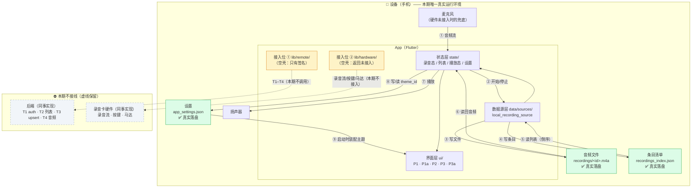

# AI 记忆卡 · 技术设计文档（TECH_DESIGN）

> **版本**：v1.0 · 2026-09-28（Day 5）
> **上游依据**：`PRD.md`（本期需求与验收标准）· `research.md`（研究总纲；对接安排见其 §5.4）
> **本文边界**：**只写前端（我负责的部分）+ 对接契约**。后端与硬件的**实现**不写，**只留接入位**。
> **一句话**：本期交的不是"能同步的产品"，是**一个能录、能放、能切主题的壳子**，而且这个壳子**不用改代码就能接上后端**。

---

## §0 本文档怎么用

### 0.1 一句话

**把 `PRD.md` 的三页需求，翻译成「文件怎么放、数据长什么样、数据怎么流动」三件事。**

### 0.2 三条阅读约定

1. **需求看 PRD，本文不重复需求**——本文只回答"怎么实现"。
2. **凡是标「暂定」的字段名，都不是最终值**——字段契约 9/30 冻结（`research.md` §5.4），冻结前随便改。
3. **本文出现的后端/硬件内容，全部是「我要它给我什么」，不是「它该怎么做」**——怎么写是同事的事。

### 0.3 写什么 / 不写什么

| | 内容 | 在本文哪里 |
|---|---|---|
| ✅ **写** | 前端目录结构、数据对象与字段、对后端的接口契约、数据流图、错误处理、前端环境变量、前端部署与迁移 | §4–§11 |
| ✅ **写** | 方案 A/B 对比与推荐（今天的技术路线决策） | §2–§3 |
| ❌ **不写** | 后端服务端代码结构、数据库表设计、云部署方案 | 由后端同事负责 |
| ❌ **不写** | 硬件 SDK、按键/马达/灯带驱动 | 由硬件同事负责 |
| ❌ **不写** | AI 转写/纪要的提示词与编排 | 本期不做（`PRD.md` §7） |

---

## §1 系统边界与分工

### 1.1 一句话分工

**我负责"用户看得见的那一层"和"对接的那一层"；数据的最终归属地不归我，但**数据的**形状**由我提出。**

### 1.2 责任表

| 层 | 谁 | **本期做什么** | **本期不做什么** |
|---|---|---|---|
| **前端（App）** | **我** | 5 页 + 2 子页的界面与跳转、**真录音与真回放**、主题切换、mock 数据源、**两个接入位（空壳）** | 不做同步、不做转写、不做纪要 |
| **对接层** | **我** | 把 T1–T4 写成**接口契约**发出去；在代码里**预留调用位置** | **本期不真正调用**任何一个接口 |
| **后端** | 后端同事 | **本期不交付**；先接收契约、9/30 前给反馈 | 不指望它跑起来 |
| **硬件** | 硬件同事 | **本期不交付**；本期用**手机麦克风 + 手机振动**兜底 | 零硬件依赖（`PRD.md` §7 N14） |
| **数据库** | 后端同事（服务端） | **本期不创建**（见 §1.3） | 前端不建库、不建表 |

### 1.3 本期"数据库"在哪（一句诚实话）

> **本期前端不创建数据库。** 不引入 SQLite、不建表、不写迁移脚本。
> 数据只落在**三个本地文件**里（§4.2、§5.6）：音频文件、条目清单 JSON、设置 JSON。
> **将来要上本地库时，只换数据源层一个文件，上层界面一行不动。**

这样做的理由：三页阶段的数据量是"个位数条目"，上数据库是**给一个还没通电的房子先装中央空调**。而 G-04（只改数据源层即可接通）要的是**分层**，不是**数据库**——分层现在就有，库可以后加。

### 1.4 三条硬规则

1. **谁的数据谁负责**：元数据「长什么样」由本文定义（契约），「存在哪」由后端决定；音频文件本期只在本机。
2. **契约冻结后不改字段名**（9/30）——真要改，通知双方、评估影响、重排期（`research.md` §5.4 ③）。
3. **不越界**：前端出问题在前端修；联调时按层归因，**不是前端的锅不要前端修**。

---

## §2 方案对比与推荐 ⭐

### 2.1 两套方案是什么

| | **方案 A：纯本地单机 App** | **方案 B：客户端 + 自建后端** |
|---|---|---|
| **一句话** | 所有数据只存在手机本地，App 单机自洽，不联网 | 客户端**本地优先**，另有自建服务端承担账号、同步与备份 |
| **组成** | Flutter App + 本机文件 | Flutter App + 后端服务 + 数据库 + 对象存储 |
| **数据在哪里** | 只在设备上 | 客户端（主副本）+ 服务端（备份与同步） |
| **换机 / 丢机** | 数据**永久消失**，无找回路径 | 元数据可拉回；音频走对象存储后也可拉回 |

### 2.2 四维对比表 ⭐（截图用）

| 维度 | **方案 A · 纯本地** | **方案 B · 自建后端** | 谁赢 |
|---|---|---|---|
| **① 学习成本** | **低**。Flutter + 文件读写即可；无网络、无鉴权、无部署、无并发。<br>新知识量 ≈ **0**（试做版已跑通录音/播放）。 | **中**（对**我**而言）。<br>我**不写后端**，但要新增掌握：**契约怎么定**、HTTP 客户端、令牌刷新、上传分片/重试、离线队列。<br>新知识量 ≈ **2 项技术 + 1 套机制**（而非后端那一整套框架）。 | **A** |
| **② 线上持久化** | **无**。数据 100% 在本机；卸载 App、丢机即全丢，多设备天然割裂。 | **有（有前提）**。元数据落服务端数据库；音频落对象存储。<br>⚠️ 前提：**音频必须走对象存储**，否则"元数据上云、音频没上云"，换机照样丢声音。 | **B** |
| **③ 费用** | **0 元**。 | **0 ~ 40 元/月**：数据库与对象存储的免费额度足够三页阶段；只有要 7×24 在线同步时才需一台轻量服务器。**本期一分钱不用花**（不接线）。 | **A**（差距可接受） |
| **④ 排错难度** | **低**。单进程、单机、无网络、无并发。出错面 = 本机存储 + 音频解码，**问题当场复现**。 | **高**。故障可能出现在「客户端 → 网络 → 服务端 → 数据库」**四层**，且同步问题是**异步、延迟暴露**的——"这条为什么没同步过去"没日志几乎无法定位。 | **A** |

**四维记分：方案 A 赢 3 项（学习成本 / 费用 / 排错难度），方案 B 赢 1 项（线上持久化）。**

### 2.3 那为什么仍然推荐方案 B？

因为**赢的那 1 项是产品的存亡项，输的 3 项都是可支付的代价。**

**理由 1｜方案 A 在架构上是死路，不是"先简单做"。**
产品的定义里有两条硬要求：**录音要能被 AI 理解**（转写 / 纪要）与**账号与多端**。这两件事都必须有服务端——第三方 API Key **绝不能打包进 App**（反编译即可盗用），只能由服务端代理调用。
所以方案 A 不是省事路径，而是**一条无论如何都要拆掉重铺的路**；省下的工期，将来连本带利还回去。

**理由 2｜"线上持久化"对目标用户是价值，不是技术洁癖。**
目标用户是**常开会、常学习、常复盘的大学生与职场人**（`PRD.md` §2.1）。记录对他们是**资产**，不是草稿。
"手机丢了，一年录音全没了"的产品，在第 3 条需求上就会被否掉。

**理由 3｜A → B 的改造代价 ≈ 重写数据层，而现在做几乎为零。**

| 改造点 | 方案 A 的默认做法 | 方案 B 必须的 | 若不预埋的代价 |
|---|---|---|---|
| 主键 | 自增 ID | **客户端生成 UUID** | 首次上传时 ID **全量重映射**，关联数据跟着重写 |
| 数据模型 | 无同步字段 | 带 `sync_state` / `updated_at` | 全量加字段 + 存量数据回填 |
| 删除语义 | 直接物理删 | **墓碑软删**（`deleted_at`） | 用户已删的记录**永远无法同步给别的设备** |

> **结论**：这三处预埋**现在做不花时间**（字段一开始就写对），将来补则是重写。所以今天**不建库，但字段按 B 设计**。

**理由 4｜我只做前端，B 的后端成本不由我承担。**
`research.md` §0.1 已定：**我的角色 = 前端 + 对接**。方案 B 多出来的服务端工作量归后端同事；**我这边增加的成本只有"对接层"**——而这本来就是我的活。真正需要我付出的，只有"按 B 设计字段"这一件事。

### 2.4 推荐结论

> ## ✅ 采用【方案 B：客户端 + 自建后端】
> **落地形态**：**B 的第 0 步——先做本地优先的壳子。**
> 即：界面、录音、回放、主题全部真实可用；数据先落本地；**接口位置留好，开关一拨就切后端**。

**一句话原因**：**方案 A 赢的三项（学习成本、费用、排错难度）都能用时间和钱买回来，但它输掉的那一项（线上持久化）是产品的存亡项，且方案 A 无法承接 AI——而 AI 是这款产品的定义本身。**

### 2.5 必须接受的代价（如实记录）

- **本期跑出来的东西不能同步**——换台手机就看不到录音。**这是本期明确接受的，不是缺陷**。
- **契约一旦冻结，改一次三处全动**（前端模型、本地文件、将来同步逻辑）——所以今天先把字段写对。
- **排错面在接线后会从 1 层变 4 层**——所以接线那天必须同时上日志（§8.4）。

---

## §3 技术路线 ⭐

### 3.1 技术路线结论行 ⭐（截图用）

> **技术路线：Flutter（首期只做 Android）+ Riverpod 状态管理 + GoRouter 路由 + `record` 真录音 + `just_audio` 真回放 + 本地文件存音频/条目/设置（**不建数据库**）+ 集中的 mock 数据源；后端（FastAPI + 数据库）由后端同事实现，前端只按契约 T1–T4 预留接入位，**本期不接线**。**

### 3.2 选型表（每一项都要有理由）

| 位置 | 选什么 | 为什么选它 | 代价 / 备注 |
|---|---|---|---|
| **App 框架** | **Flutter 3.47.4**（本机实测已装，Dart 3.13.3） | **试做版已用它跑通录音+播放**，有可直接搬的经验；一套代码将来可扩 iOS | 首期只跑 Android（`PRD.md` §7 N22）；Windows 上无法编译 iOS |
| **状态管理** | **flutter_riverpod** | 试做版已在用；录音态/列表/主题三处状态都需要跨页读取 | 多一个概念要学（provider），但比手写 setState 清晰 |
| **路由** | **go_router** | 5 页 2 子页的跳转 + 返回不丢状态（A-09 / F-25）用声明式路由最省事 | —— |
| **录音** | **`record`** | 试做版验证过的插件；原生调用、延迟低、能出电平数据（F-15 波形） | ⚠️ **已知坑**：`record` 版本与 `record_linux` 有约束冲突，需 `dependency_overrides` 锁 `record_linux: ^1.3.1`（试做版踩过） |
| **音频格式** | **`m4a` / AAC-LC / 44.1 kHz / 单声道 / 128 kbps** | 体积小（**1 小时 ≈ 58 MB**，比 WAV 省约 20 倍）、Android 原生支持、`just_audio` 直接能播、与 `PRD.md` §5.1 一致 | ✅ **2026-09-28 已定**（前端侧）。44.1 kHz 保回放音质（C-04），单声道因为录的是人声。后端是否接受属契约 **T4**，**不属前端单方定** |
| **播放** | **`just_audio`** | 支持进度条拖动（F-23）与暂停续播（F-22），试做版已验证 | —— |
| **文件与目录** | **`path_provider`** | 拿到 App 私有目录，音频文件与 JSON 都放这 | 卸载即清空——这正是要方案 B 的原因 |
| **权限** | **`permission_handler`** | 麦克风权限被拒时要能跳系统设置（`PRD.md` EX-01） | —— |
| **本地存储** | **JSON 文件**（不建库） | 三页阶段数据量个位数；**零新增依赖**；将来换 SQLite 只改数据源层 | 数据量上千条后需换成 SQLite（届时改一个文件） |
| **主题** | **主题清单常量 + `theme_id` 落本地 JSON** | 对应"**主题由开发者上传**"（`PRD.md` §3.2）：**清单是数据、不是代码**，将来新增主题不改一行业务代码 | 本期内置 `theme_light` / `theme_dark` 两套 |
| **假数据** | **`lib/data/mock/mock_seed.dart` 一处** | 对应验收 **G-01**（假数据不许散落） | 见 §7.4 的重要澄清 |
| **时间格式化** | **`intl`** | 列表要显示日期（F-11 / F-17） | —— |

### 3.3 被放弃的方案（如实记录）

| 放弃的方案 | 为什么不选 | 代价是什么 |
|---|---|---|
| 原生 Android（Kotlin）单端开发 | 与试做版资产不兼容，等于从零开始；将来扩 iOS 要重写 | 放弃"少一层框架"的性能与包体积优势 |
| React Native / uni-app | 试做版没有可复用工程；录音与文件权限在跨端框架里坑更多 | —— |
| 直接上 SQLite | 本期数据量个位数，属于过度设计（见 §1.3） | 数据量上来时要补一次迁移（已预留字段，改动可控） |
| 后端自己写（FastAPI） | **不在我的职责范围**（`research.md` §0.1）；会拖垮前端进度 | 本地联调时要等后端同事给环境 |

---

## §4 项目结构

### 4.1 仓库总览

```
06-AI记忆卡/                      ← 仓库根目录（文档 + 代码同仓）
├── AGENTS.md                     ← 协作规则（已入库）
├── research.md                   ← 研究总纲（已入库）
├── PRD.md                        ← 本期需求与验收（已入库）
├── TECH_DESIGN.md                ← 本文（Day 5 产出）
├── 竞品研究/                      ← 竞品对标（已入库）
├── mvp实验产品/                   ← 试做版完整归档（背景参考，口径已被取代）
└── app/                          ← ⭐ 本期前端代码在这里（Day 5 起新建）
    ├── lib/
    ├── android/                  ← 平台工程（flutter create 生成）
    └── pubspec.yaml              ← 依赖清单（版本锁死）
```

> **两个仓库内不存在的目录，是"刻意不存在"**：没有 `server/`（后端同事的仓库/目录，不占我们的位置）、没有 `docs/db/`（本期不建库）。

### 4.2 客户端目录树（`app/lib/`）

```
lib/
├── main.dart                     ← 入口：只做初始化和主题注入
├── app.dart                      ← MaterialApp + 主题装配（读 theme_id）
│
├── core/                         ← 与业务无关的公共件
│   ├── constants/
│   │   ├── app_constants.dart    ← 版本号、产品名等常量
│   │   └── audio_constants.dart  ← ⭐ 音频格式/编码/采样率/码率（已定，改这里一处生效）
│   ├── theme/
│   │   ├── theme_pack.dart       ← ⭐ 主题包模型（id + 名称 + 配色）
│   │   └── theme_registry.dart   ← ⭐ 主题清单（本期 2 套；将来"开发者上传"只换这里）
│   ├── error/app_exception.dart  ← 统一异常类型（对应 §8.1 的分层）
│   └── utils/
│       ├── time_formatter.dart   ← 时长/日期显示（F-11 / F-17）
│       └── logger.dart           ← 最小日志（§8.4）
│
├── models/                       ← ⭐ 数据对象（本文 §5 一一对应）
│   ├── recording.dart            ← 录音条目（唯一真实落盘的数据对象）
│   ├── user_profile.dart         ← 用户资料（本期占位）
│   └── app_settings.dart         ← 应用设置（theme_id）
│
├── data/                         ← ⭐ 数据从哪来（唯一允许碰 IO 的地方）
│   ├── sources/
│   │   ├── recording_source.dart        ← ⭐ 抽象接口（本地/远端两套实现都实现它）
│   │   ├── local_recording_source.dart  ← ⭐ 本期实现：读/写本地 JSON + 音频文件
│   │   └── remote_recording_source.dart ← ⛔ 空壳（本期只有方法签名 + TODO）
│   ├── mock/
│   │   └── mock_seed.dart        ← ⭐ 写死数据**只在这里**（G-01）
│   ├── repositories/
│   │   └── recording_repository.dart    ← 缓存 + 排序（倒序，B-08）对外只暴露这一个
│   └── storage/
│       └── local_paths.dart      ← 三个文件到底放哪（§5.6）
│
├── remote/                       ← ⭐ 接入位 ①：对后端
│   ├── api_client.dart           ← ⛔ 空壳：baseUrl 读环境变量，方法体 TODO
│   ├── auth_api.dart             ← ⛔ 空壳：T1
│   ├── meetings_api.dart         ← ⛔ 空壳：T2 / T3
│   └── media_api.dart            ← ⛔ 空壳：T4
│
├── hardware/                     ← ⭐ 接入位 ②：对录音卡硬件
│   ├── recording_card.dart       ← ⛔ 空壳：接口定义（录音流/按键/马达/电量）
│   └── card_stub.dart            ← 本期实现：一律返回"未接入"，界面据此回落到手机麦克风
│
├── engine/                       ← ⭐ 真正干活的机制
│   ├── recorder_engine.dart      ← record 的封装：开始/停止/电平流/写文件
│   ├── player_engine.dart        ← just_audio 的封装：播放/暂停/seek/进度流
│   └── permission_gate.dart      ← 麦克风与存储权限（EX-01 / EX-04）
│
├── state/                        ← riverpod provider（界面只读这里）
│   ├── recorder_provider.dart    ← 录音态（计时、电平、录没在录）
│   ├── recordings_provider.dart  ← 列表（最近 3 条 / 全部）
│   ├── player_provider.dart      ← 播放态（进度、时长、播放中）
│   └── settings_provider.dart    ← theme_id（读写本地 JSON）
│
└── ui/
    ├── routing/app_router.dart   ← 5 页 2 子页的路由表（§12.1）
    ├── screens/
    │   ├── p1_profile_screen.dart       ← P1 个人页面
    │   ├── p1a_settings_screen.dart     ← P1a 设置页（主题）
    │   ├── p2_home_screen.dart          ← P2 首页（欢迎区+入口+最近录音）
    │   ├── p3_recorder_screen.dart      ← P3 录音功能页（嵌套在首页里）
    │   └── p3a_playback_screen.dart     ← P3a 回放页
    └── widgets/                  ← 录音大按钮、计时器、电平条、列表项、空状态
```

### 4.3 分层规则（硬规则，防"改一处崩三处"）

**依赖方向只能从上往下，禁止反向：**

```
ui/  →  state/  →  data/repositories  →  data/sources  →  (本地文件 / remote / hardware)
                                  ↑
                            models/（谁都能用，谁也不改它）
```

1. **界面不许直接读写文件、不许直接调插件**——只能通过 `state/`。这样换数据源时 `ui/` 一行不动（G-04）。
2. **`data/` 是唯一允许碰 IO 的目录**——别的目录里出现 `File(...)` / `http` 就是违规。
3. **假数据只从 `mock/mock_seed.dart` 进**——它只是**种子**（见 §7.4）。

### 4.4 两个"接入位"在哪（本期只留空壳，不写实现）

| 接入位 | 目录 | 本期状态 | 接线那天要做什么 |
|---|---|---|---|
| **后端 API** | `lib/remote/` | **空壳**：只有类名、方法签名、`// TODO` | 填方法体 → 实现 `RemoteRecordingSource` → 开关切过去 |
| **录音卡硬件** | `lib/hardware/` | **空壳**：`card_stub.dart` 一律返回"未接入" | 实现 `RecordingCard`，界面自动从"手机麦克风"回落逻辑里切走 |

> **这两处现在为什么值得先建**：因为建了它们，**"接线"就变成"填空"**；不建，将来就是"改结构"。

---

## §5 数据对象及字段

> **本节 = 数据契机的"形状"**，字段与 `PRD.md` §5 **完全一致**，本文不新增字段。
> **本期不建库**：这些字段落在**代码里的模型类**和**本地 JSON**，不在数据库表里。
> 标「暂定」的名字，9/30 契约冻结前都可改。

### 5.1 三个对象（本期只有三个）

| 对象 | 本期真实度 | 落到哪 |
|---|---|---|
| **Recording**（录音） | ✅ **真实**——真文件、真条目 | 音频文件 + `recordings_index.json` |
| **AppSettings**（应用设置） | ✅ **真实**——真落盘 | `app_settings.json` |
| **UserProfile**（用户资料） | ⚠️ **占位**——值是假的，结构是真的 | `mock_seed.dart`（不落盘） |
| AuthToken | ⛔ 本期不用 | 只定义结构，不实例化 |

### 5.2 Recording（录音）—— 本期唯一真正存下来的数据

| 字段 | 含义 | 类型 | 来源 | 本期状态 |
|---|---|---|---|---|
| `id` | 录音唯一标识 | 字符串（**UUID**） | 客户端生成 | ✅ 真实（**为将来上传预埋，不用自增 ID**） |
| `title` | 标题 | 字符串 | 客户端（「未命名录音」+ 时间） | ✅ 真实 |
| `created_at` | 录制时间 | 时间戳 | 客户端 | ✅ 真实 |
| `duration_ms` | 时长（毫秒） | 整数 | 客户端（停止时算出） | ✅ 真实 |
| `file_path` | 音频文件在本机的位置 | 字符串 | 客户端 | ✅ 真实 |
| `file_size` | 文件大小（字节） | 整数 | 客户端 | ✅ 真实 |
| `format` | 音频格式 | 字符串（本期固定 `m4a`） | 客户端 | ✅ 真实（常量在 `audio_constants.dart`） |
| `sync_state` | 同步状态 | 枚举（未同步/同步中/已同步） | 客户端 | ⚠️ **恒为「未同步」**（本期不接线） |
| `remote_id` | 服务端返回的 id | 字符串 / 空 | 后端（T3/T4） | ⛔ 本期为空 |
| `transcript` | 转写文本 | 字符串 / 空 | 后端 + AI | ⛔ 本期不做（`PRD.md` §7 N1） |
| `summary` | 纪要内容 | 字符串 / 空 | 后端 + AI | ⛔ 本期不做（`PRD.md` §7 N2） |

### 5.3 UserProfile（用户资料）

| 字段 | 含义 | 类型 | 来源 | 本期状态 |
|---|---|---|---|---|
| `id` | 用户标识 | 字符串 | 后端（T1） | 占位值 |
| `nickname` | 昵称 | 字符串 | 后端（T1） | 占位（「未设置昵称」） |
| `avatar_url` | 头像地址 | 字符串 / 空 | 后端（T1） | 占位图 |
| `account` | 账号（手机号/邮箱） | 字符串 | 后端（T1） | 占位值 |
| `logged_in` | 是否已登录 | 布尔 | 客户端 | 仅本地标记（EX-11 靠它判断） |

### 5.4 AppSettings（应用设置）—— 纯本地

| 字段 | 含义 | 类型 | 取值范围 | 本期状态 |
|---|---|---|---|---|
| `theme_id` | 当前生效的主题 | 字符串 | **开发者上传的主题标识**（本期内置 `theme_light` / `theme_dark`） | ✅ 真实，写 `app_settings.json` |
| `theme_list` | 可选主题清单 | 列表 | **由开发者上传决定**；新增只换清单，**不改代码** | 本期为 `theme_registry.dart` 里的常量 |

### 5.5 AuthToken（账号凭证）—— 本期不用，但先定义

| 字段 | 含义 | 来源 | 本期状态 |
|---|---|---|---|
| `access_token` | 访问令牌 | 后端（T1） | ⛔ 不用 |
| `refresh_token` | 刷新令牌 | 后端（T1） | ⛔ 不用 |
| `expires_at` | 过期时间 | 后端（T1） | ⛔ 不用 |

> **为什么列本期不用的字段**：它们是**对后端的契约**的一部分。提前列出来 = 提前告诉后端"我将来要这几个"（`PRD.md` §5.4）。

### 5.6 本期数据实际落在哪三个文件

| 文件 | 装什么 | 谁写 | 谁读 |
|---|---|---|---|
| `{App 私有文档目录}/recordings/<id>.m4a` | **音频本体** | `recorder_engine` | `player_engine` |
| `recordings_index.json` | 条目列表（§5.2 字段） | `local_recording_source` | 列表页 |
| `app_settings.json` | `theme_id`（§5.4） | `settings_provider` | `app.dart`（启动时装配主题） |

**字段规则（防返工）**：改字段 **先改 `PRD.md` §5 再改代码**；字段名被契约采用后**冻结**；新增字段**必须标来源**（客户端/后端/硬件）。

---

## §6 API 列表

### 6.1 本期实际调用的接口：**0 个**（诚实声明）

> 本期**不接通后端**（`PRD.md` §1.4）。下面这张表**不是调用清单，是我要发给后端的契约诉求**，
> 与 `PRD.md` §5.6 一致。**它存在的意义是：等接口一到，我只换数据源层。**

### 6.2 对后端的契约（本期要发的 4 个）

| # | 接口 | 用在哪一页 | 本期是否真的调用 | 对端要保证什么 |
|---|---|---|---|---|
| **T1** | `POST /auth/*`（注册 / 登录 / 刷新 / 登出） | P1 个人页面 · 账号视图 | ❌ 不调用（账号区占位） | 返回 §5.5 的 `access_token / refresh_token / expires_at` |
| **T2** | `GET /meetings`（录音 / 会议列表） | P2 最近录音 · P3 历史录音 | ❌ 不调用（列表走本地） | 返回须含 §5.2 的 `id / title / created_at / duration_ms` |
| **T3** | `PUT /meetings/{id}`（幂等 upsert） | P3 保存记录 | ❌ 不调用（本期纯本地） | **客户端生成 `id`（UUID），PUT 必须幂等**（重放不产生重复条目） |
| **T4** | `POST /media/upload`（音频上送） | P3 → 后续回放 | ❌ 不调用 | 走对象存储，返回 `remote_id`（§5.2） |

**三条前端侧的硬要求**（写进契约，减少将来返工）：

1. **列表字段一次定好**——P2「最近录音」与 P3「历史录音」是**同一份数据**，不许做成两个接口。
2. **上传要能续**——录音可能几分钟到几小时，上传必须支持**分片或可重传**，否则断网一次就得重录。
3. **字段契约冻结**——一改，前端模型、本地文件、同步逻辑三处全动。

### 6.3 本期明确不要的接口（免得后端提前做）

`GET /meetings/{id}/transcript`（转写）· `GET /meetings/{id}/summary`（纪要）· `DELETE /meetings/{id}`（删除）· `GET /meetings?since=`（增量同步）

### 6.4 前端预留的调用点（接线时改哪里）

| 接线动作 | 改哪个文件 | 界面要不要动 |
|---|---|---|
| 填接口实现 | `lib/remote/*.dart`（4 个空壳） | ❌ 不动 |
| 从本地源切远端源 | `lib/data/sources/remote_recording_source.dart` | ❌ 不动 |
| 开关 | `USE_MOCK`（环境变量，§9.1） | ❌ 不动 |

---

## §7 数据流 ⭐（今天要能一句话说清）

### 7.1 一句话数据流

> **音频从麦克风进 → 写成手机上的一个文件 → 条目写进一个本地 JSON → 列表读 JSON 显示 → 回放页读回那个文件播放出去。**
> **出去的那一路（上后端）本期是断的，线留着。**

### 7.2 数据流图（Mermaid）



### 7.3 数据流图（纯文本兜底版 —— 图渲染不出来时看这个）

```
【录音线】  麦克风 ──①──> 状态层 ──②──> 数据源层 ──③──> 📄 recordings/<id>.m4a   （真落盘）
                                          └──④──> 📄 recordings_index.json     （真落盘）

【回看线】  📄 recordings_index.json ──⑤读列表──> 数据源层 ──> 状态层 ──> 界面（倒序显示）
            📄 recordings/<id>.m4a ──⑥读音频──> 播放引擎 ──⑦──> 🔊 扬声器

【主题线】  设置页点选 ──⑧──> 📄 app_settings.json（theme_id）──⑨启动时装配──> 全局配色

【将来线·虚线·本期断】 数据源层 ┄┄T3/T4┄┄> 后端 ┄┄T2┄┄> 列表改从远端读
【将来线·虚线·本期断】 数据源层 ┄┄┄┄┄┄> 录音卡硬件（录音流取代麦克风）
```

### 7.4 逐条数据的来龙去脉（点着图能答）

| # | 数据 | 从哪来 | 到哪去 | 本期真实吗 |
|---|---|---|---|---|
| ① | 音频流 | 手机麦克风 | 录音引擎缓冲 | ✅ 真实 |
| ② | 开始/停止指令 | 录音大按钮 | 录音引擎 | ✅ 真实 |
| ③ | **音频文件** | 录音引擎写盘 | `recordings/<id>.m4a` | ✅ **真落盘**（B-07 / C-04 靠它） |
| ④ | **条目**（§5.2 字段） | 停止录音时组装 | `recordings_index.json` | ✅ **真落盘** |
| ⑤ | 列表 | JSON 读出来，按 `created_at` **倒序** | 首页(3 条) / 录音页(全部) | ✅ 真实 |
| ⑥⑦ | 播放 | 回放页 → 播放引擎读文件 → 扬声器 | 用户耳朵 | ✅ 真实 |
| ⑧⑨ | 主题 | 设置页点选 → `theme_id` → 启动装配 | 全局配色 | ✅ 真实（D-05 / D-06） |
| ┄ | 上传后端 | — | — | ⛔ **本期断**（线留着） |

> ⭐ **一处重要澄清（防止把"写死"做错）**：
> "数据写死"指的是**列表里的历史条目**——它们来自 `mock_seed.dart` 的**种子**，
> 但**种子只在第一次启动时写进 `recordings_index.json`，之后所有读写都走这个文件**。
> 换句话说：**"假"只假在初始内容，"真"真在存储链路**。
> 所以录完的新条目能留在列表里、退出 App 还在（B-06 / B-07）——**因为写文件的链路是真的**。
> 等接口一到，只把"读/写这个 JSON"换成"调 T2/T3"，**播放器与界面一行不动**。

---

## §8 错误处理

### 8.1 四层错误分类（先分类，再定谁修）

| 层 | 典型错误 | 本期是否会出现 | 谁来修 |
|---|---|---|---|
| **① 权限类** | 麦克风被拒、存储权限 | ✅ 会 | 前端（给提示 + 去设置） |
| **② 设备/文件类** | 空间不足、文件损坏、解码失败 | ✅ 会 | 前端（兜底 + 不崩） |
| **③ 业务状态类** | 列表为空、未登录 | ✅ 会 | 前端（空状态文案） |
| **④ 网络/服务端类** | 超时、401、5xx | ❌ **本期不会**（不接线） | 接线后按层归因 |

### 8.2 `PRD.md` 的异常 → 技术处理映射

| PRD 异常 | 技术处理 | 界面表现 |
|---|---|---|
| **EX-01** 麦克风权限被拒 | `permission_gate` 捕获 → 状态置 `permissionDenied` | 提示条 + 「去设置」按钮（跳系统页） |
| **EX-02** 录音被来电打断 | 监听录音流中断 → **先落盘已录部分** | 状态文字「录音已中断」，已录部分保留成条目 |
| **EX-03** 录音中 App 被杀 | 开始录音就**先建条目占位**（状态「录音中」）；下次启动扫到未收尾的条目 → 标「异常结束」 | 列表出现带异常标记的条目 |
| **EX-04** 存储空间不足 | 开始录音前检查可用空间 → 不足则拒绝开始 | 「存储空间不足，无法开始录音」 |
| **EX-05** 音频文件丢失 | 播放前校验文件存在 → 不存在则置异常态 | 「音频文件已不可用」+ 列表项异常标记，**不自动删条目** |
| **EX-06** 播放失败 | `player_engine` 捕获解码/IO 异常 | 播放按钮禁用 + 「无法播放此录音」，**界面不卡死** |
| **EX-07** 历史录音为空 | 列表空集合判断 | 「还没有录音」+ 引导文案 |
| **EX-08** 最近录音为空 | 同上（首页版文案） | 「还没有录音，去录第一条吧」 |
| **EX-09** 无网络 | 本期**不使用任何网络 API** | 三页全功能正常；**出现"需要网络"即为缺陷** |
| **EX-10** 修改密码提交 | **不发请求**，只写本地 demo 标记 | 「已保存（本地演示）」——**不得显示"修改成功"** |
| **EX-11** 退出后进个人页 | `logged_in=false` → 取"未登录"视图 | 头像区「未登录」+「去登录」，**不显示上个账号数据** |

### 8.3 三条禁令

1. **不许静默失败**——任何异常都要有可见的界面反馈（EX-01 尤其）。
2. **不许假装成功**——EX-03 / EX-05 / EX-10 属数据类，宁可显示异常也不糊弄（`PRD.md` §6.1）。
3. **不许白屏或卡死**——异常至少要给"文案 + 一条出路（重试/返回/去设置）"。

### 8.4 日志（本期最小版）

本期只做一件事：**关键动作打一行日志**（开始录音、停止录音并落盘成功/失败、播放失败、主题切换）。
落在 `core/utils/logger.dart`，开发期输出到控制台。
**接线那天必须升级**——因为"这条为什么没同步过去"没有日志无法定位（第 4 层错误看不到）。

---

## §9 环境变量与配置

### 9.1 客户端配置（本期全部就这几项）

| 配置项 | 默认值 | 作用 | 本期是否生效 |
|---|---|---|---|
| `USE_MOCK` | `true` | 数据源开关：`true` = 本地 JSON，`false` = 调后端 | ✅ 生效（恒为 true） |
| `API_BASE_URL` | 空 | 后端地址（T1–T4 的前缀） | ⛔ 本期不读 |
| `RECORDING_FORMAT` | `m4a` | 音频格式；编码/采样率/声道/码率一并落在此常量文件（`m4a` + AAC-LC + 44.1 kHz + 单声道 + 128 kbps，**已定**） | ✅ 生效 |
| `THEME_PACK_LIST` | `theme_light, theme_dark` | 可选主题清单（落在 `theme_registry.dart`） | ✅ 生效 |

> 前两项走 **`--dart-define`**（Flutter 的编译期环境变量），**不写死在代码里**——这样换环境不用改代码。

### 9.2 服务端环境变量

> ⛔ **不在本文范围**——后端的环境变量由后端同事管理。**我不需要知道，也不应该拿到它们的值**（下面 §9.3 第 2 条）。

### 9.3 密钥与配置规则（硬规则）

1. **密钥永远不进客户端**——第三方 API Key 打包进 App = 反编译即可盗用（这也是选方案 B 的核心原因）。
2. **`.env`、连接串、密钥不进代码、不进提交**（`AGENTS.md` 五.3）。
3. **前端能拿到的最多只有 `API_BASE_URL`**——它只是地址，不是凭证。

---

## §10 部署（前端）

### 10.1 本机条件（实测，2026-09-28）

| 项 | 状态 | 证据 |
|---|---|---|
| **Flutter SDK** | ✅ 已装 | `D:\development\flutter`，版本 **3.47.4 stable**（Dart 3.13.3） |
| **`flutter` 已在 PATH** | ✅ 已配 | 直接敲 `flutter` 即可，**不必写全路径** |
| **`adb` 已在 PATH** | ✅ 已配 | `D:\development\android-sdk\platform-tools\adb.exe` |
| **Android SDK** | ✅ 已装 | `ANDROID_HOME = D:\development\android-sdk` |
| **JDK** | ✅ 已装 | `JAVA_HOME = D:\development\JDK` |
| **pub 国内镜像** | ✅ 已配 | `PUB_HOSTED_URL=https://pub.flutter-io.cn` · `FLUTTER_STORAGE_BASE_URL=https://storage.flutter-io.cn` → 装依赖不会卡 |
| **Android 模拟器（AVD）** | ❌ **一个都没有** | `~/.android/avd` 不存在 → **要跑只能插真机**，或先自己建一个 AVD |
| **完整工具链体检** | ⚠️ **待你在自己终端跑** | 我这边 `flutter doctor` / `flutter devices` **均被沙箱拦下**（flutter 会调 `reg.exe` 读注册表，而 `reg.EXE` 在本机安全策略黑名单里），**结论未验证** |

**你要自己动手做的事**（我不替你跑）：
1. 打开 CMD 或 PowerShell，运行 **`flutter doctor`**；
2. **该看到**：`Flutter`、`Android toolchain`、`Android Studio`（或 `cmdline-tools`）三行是 `[√]`；
3. **常见坑**：Android licenses 未接受 → 按提示跑 `flutter doctor --android-licenses` 全部 `y`。

### 10.2 本期怎么跑起来

```bash
# ① 建工程（Day 6 起，今天不执行）
cd D:\06-AI记忆卡
flutter create --org com.aimemorycard --project-name ai_memory_card app

# ② 装依赖
cd app && flutter pub get

# ③ 连上 Android 手机（开 USB 调试）或启模拟器，确认设备可见
flutter devices

# ④ 跑起来
flutter run
```

**该看到什么**：手机上出现 App 图标 → 打开直接进**首页**（A-01：不经过任何登录页）。

> **首期只做 Android**（`PRD.md` §7 N22）。Windows 上**编不了 iOS**，这不是配置问题，是平台限制——**不要把时间花在试 iOS 上**。

### 10.3 服务端部署

⛔ **不在本文范围**。后端同事负责，前端只在本地联调时把 `API_BASE_URL` 指过去。

---

## §11 迁移注意事项

### 11.1 本期没有数据库迁移 —— 只有"三种迁移"

| # | 迁移 | 什么时候发生 | 要改哪里 | 风险 |
|---|---|---|---|---|
| **①** | **mock → 真接口** | 后端交付后 | 填 `lib/remote/*` 4 个空壳 → 实现 `RemoteRecordingSource` → `USE_MOCK=false` | **低**（界面与播放器不动，这正是分层的意义） |
| **②** | **本地 JSON → 本地 SQLite** | 条目上千条以后 | 只换 `local_recording_source.dart` | 中（要写数据搬运脚本；字段已按 B 设计，不需改模型） |
| **③** | **新增主题包** | 开发者上传新配色时 | 只改 `theme_registry.dart` 的清单 | **零**（**App 端不改业务代码**，`PRD.md` §3.2 的口径） |

### 11.2 为将来"上数据库"预留的三处（现在只体现在**模型**里）

| 预埋 | 现在的做法 | 不预埋的代价 |
|---|---|---|
| **UUID 主键** | `id` 一开始就是客户端生成的 UUID | 上传时 ID 全量重映射 |
| **同步状态** | `sync_state` 字段先留着（恒为"未同步"） | 全表加字段 + 存量回填 |
| **删除语义** | 本期不做删除；将来加 `deleted_at` **墓碑软删**，不物理删 | 已删记录永远同步不出去 |

### 11.3 依赖版本迁移

- `pubspec.yaml` **锁版本**（不写 `any`）。
- ⚠️ **已知坑（试做版踩过）**：`record` 与 `record_linux` 有约束冲突，需在 `dependency_overrides` 里锁 `record_linux: ^1.3.1`。**升级 `record` 前先看这条。**
- Flutter SDK 升级前：先 commit，升级后跑一遍三页手工验收（B 组 + C 组）。

### 11.4 回滚策略

**只走安全路径**：`git revert <commit>`（保留历史）。
**禁止** `git reset --hard`、禁止强制推送（`AGENTS.md` 七.1）。
数据侧的回滚：本地文件是**追加式**的（录音只增不减），**不会因为代码回滚而丢录音**。

---

## §12 与 PRD 的对应（可追溯性）

### 12.1 页面 → 文件映射（5 页 + 2 子页全覆盖）

| PRD 编号 | 页面 | 文件 |
|---|---|---|
| **P1** | 个人页面 | `ui/screens/p1_profile_screen.dart` |
| **P1a** | 设置页 | `ui/screens/p1a_settings_screen.dart` |
| **P2** | 首页 | `ui/screens/p2_home_screen.dart` |
| **P3** | 录音功能页（嵌套首页） | `ui/screens/p3_recorder_screen.dart` |
| **P3a** | 回放页 | `ui/screens/p3a_playback_screen.dart` |
| — | 账号视图（P1 子视图） | P1 内嵌视图（不单独占路由） |

### 12.2 功能 → 模块映射（F-01 ~ F-25）

| 功能组 | 实现位置 |
|---|---|
| F-01 ~ F-05（个人页面） | `p1_profile_screen` + `user_profile` 模型（占位） |
| F-06 ~ F-08（设置 / 主题） | `p1a_settings_screen` + `settings_provider` + `theme_registry` |
| F-09 ~ F-13（首页） | `p2_home_screen` + `recordings_provider` |
| F-14 ~ F-19（录音） | `p3_recorder_screen` + `recorder_engine` + `recorder_provider` + `local_recording_source` |
| F-20 ~ F-24（回放） | `p3a_playback_screen` + `player_engine` + `player_provider` |
| F-25（通用返回） | `ui/routing/app_router.dart`（返回不重建页面） |

### 12.3 关键验收项的技术支撑（这几条是硬骨头）

| 验收 | 靠什么实现 |
|---|---|
| **A-08**（录音页底部无 Tab） | 路由层级：P3 是 P2 的**子路由**，不是并列 Tab |
| **A-09 / F-25**（返回不丢状态） | go_router 的父路由保活 + provider 状态在路由之上 |
| **B-07**（退出重进录音还在） | **真落盘** `recordings_index.json`（§7.4 澄清） |
| **C-04**（能听到自己的声音） | `record` 真写文件 + `just_audio` 读同一文件 |
| **D-06**（主题重启还在） | `app_settings.json` 持久化 `theme_id` |
| **G-01**（假数据集中一处） | 只有 `data/mock/mock_seed.dart` |
| **G-04**（只改数据源即可接通） | `RecordingSource` 抽象 + 两个实现（§4.3 分层规则） |
| **E-04**（飞行模式全部正常） | 本期**不引入任何网络调用**（§6.1） |

---

## §13 待明确事项（2026-09-28 收尾：前端项已全部关闭）

> **收尾规则**：本表只应放「**会影响我写代码、且我能自己定**」的事。
> 凡属前端的 → **本人直接拍板**，不问、不等；凡**不属前端的** → **移出本表、本期不再跟踪**，避免"拿别人的活当自己的欠账"。

### 13.1 已关闭（前端，2026-09-28 定）

| # | 事项 | 结论 | 落点 |
|---|---|---|---|
| **T-1** | 代码放 `app/`（新建）还是复用 `mvp实验产品/app` | ✅ **新建 `app/`**（干净起步，不继承旧口径） | §4.1 / §10.2 |
| **T-2** | 音频格式取 `m4a` 还是 `wav` | ✅ **`m4a` / AAC-LC / 44.1 kHz / 单声道 / 128 kbps** | §3.2 / §5.2 / `audio_constants.dart` |
| **T-3** | 主题持久化用 JSON 文件还是 key-value 插件 | ✅ **JSON 文件**（`app_settings.json`，零新增依赖） | §5.4 |

### 13.2 已移出（非前端 —— 不由我定、也不由我跟踪）

| # | 事项 | 原来卡在哪 | 处理 |
|---|---|---|---|
| ~~T-4~~ | 契约是否 9/30 如期冻结 | 决定接线日 | ➖ **移出**：等后端 / 团队，前端不为它空等 |
| ~~T-5~~ | 本阶段工期 | 排期与验收时点 | ➖ **移出**：团队排期（`PRD.md` 附录 A 第 4 项） |
| ~~T-6~~ | 后端 API 文档产出时点 | 决定何时从本地切真接口 | ➖ **移出**：9/28 契约已发，等对方交付 |
| ~~T-7~~ | AI-调（纪要提示词）负责人 | 第二阶段"出纪要"的前置 | ➖ **移出**：**不属前端**（`research.md` §8 第 20 项，本阶段即已不阻塞） |

### 13.3 结论

**前端侧的技术待定项 = 0。** Day 6 起可直接按 §4 目录树建工程，**无需等待任何外部输入**；
外部输入（契约 / 硬件 SDK）到货后，只改 §4.4 那两个接入位（`lib/remote/`、`lib/hardware/`）。

---

## 附录 A · 本文件自检记录

### A.1 今日模板要求逐条核对

| 模板要求 | 本文位置 | 状态 |
|---|---|---|
| 项目结构 | §4 | ✅ |
| 数据对象及字段 | §5 | ✅ |
| API 列表 | §6 | ✅ |
| 数据流 | §7（含 Mermaid + 文本兜底） | ✅ |
| 错误处理 | §8 | ✅ |
| 环境变量 | §9 | ✅ |
| 部署 | §10 | ✅ |
| 迁移注意事项 | §11 | ✅ |
| 方案 A/B 四维对比（学习成本/线上持久化/费用/排错难度） | §2.2 | ✅ |
| 推荐一套并说明原因 | §2.3 / §2.4 | ✅ |
| 技术路线那一行（截图用） | §3.1 | ✅ |
| 只写前端、非前端内容省略 | §0.3 + §1.2 边界表 | ✅ |

### A.2 交叉核对（与上游文档是否打架）

| 核对项 | 结果 |
|---|---|
| 字段是否与 `PRD.md` §5 一致 | ✅ 一致，**未新增任何字段** |
| 接口是否与 `PRD.md` §5.6 / `research.md` §5.4 一致 | ✅ 均为 T1–T4，排除项也一致 |
| 页面编号是否为 P1/P1a/P2/P3/P3a | ✅ 一致 |
| 异常编号是否用 `EX-xx` | ✅ 一致（不与验收 E 组混） |
| 是否与"本期不接通后端"矛盾 | ✅ 通篇不接通；接口表已标"不调用" |
| 是否与"数据库暂时不创建"一致 | ✅ 不建库；只落 3 个本地文件 |

### A.3 本轮未能自行验证、留给用户的部分

1. **`flutter doctor` 的完整结论**——沙箱拦了（它要读注册表），需你在自己终端跑一次（§10.1）。
2. **`record` 插件的具体版本**——本文沿用试做版验证过的 `^5.1.2` + `record_linux` 覆盖；实际以 Day 6 `flutter pub get` 的结果为准。
3. **Android 真机联调**——需要你在手机上开 USB 调试后 `flutter devices` 确认可见。
