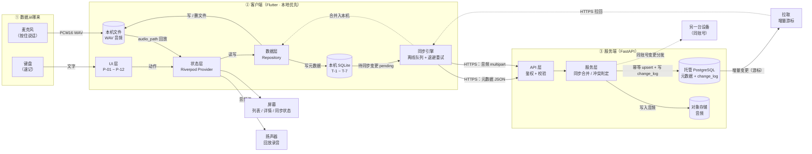

# AI 记忆卡 · 技术设计文档（TECH_DESIGN）

> **项目名称**：AI 记忆卡（AI Memory Card）
> **文档类型**：技术设计文档（Technical Design Document）
> **版本**：**v0.5**（2026-09-22 补「修订号」契约：`updated_at` 不只是时间戳，而是幂等 upsert 的**修订号**——未同步增大时服务端不落库；为免静默丢改动，响应新增 `content_differs`；并明确 `conflict` 字段本期未实现）
> **编制日期**：2026-09-21（v0.5 修订于 2026-09-22）
> **当前阶段**：Vibe Coding 五步工作流 · 第 3 步（技术设计）
> **上游文档**：`PRD.md`（v0.5，需求规格）
> **下游文档**：`docs/system_design.md`（口语线子设计，本文档的子设计之一）
> **文档边界**：本文档只描述「用什么技术、为什么用它、数据怎么流、出错怎么办、怎么部署与升级」；**不写代码**、**不改需求**（需求以 `PRD.md` 为准）。

---

## 0. 本版变更

### 0.1 v0.4 → v0.5（本轮：补「修订号」契约，修静默丢弃）

| # | 变更 | 起因 |
|---|---|---|
| 1 | 🔧 **补上 `updated_at` 是「修订号」的契约说明**：`PUT /memories/{id}` 在 `updated_at` 未增大时返回 `unchanged` 且不覆盖（LWW，**设计如此不改**）；但**若内容实际不同**，此前会静默当作重复上传丢弃 —— HTTP 200 却丢数据。现要求响应新增 `content_differs: bool`，并让服务端打一条 WARN 日志 | 联调实测：改标题但不增大 `updated_at` → 200 `unchanged`，库里仍是旧值，客户端会误判为同步成功 |
| 2 | 📌 **明确 `conflict` 字段本期未实现**：原响应示例预留的 `conflict: {server_updated_at, kept}` 只是占位，本期不产生该结构 —— 消除「文档承诺了代码没做的事」 | 同上，顺带消除文档与实现的不一致 |

### 0.2 v0.3 → v0.4（可追溯性自检）

| # | 变更 | 起因 |
|---|---|---|
| 1 | **重写第 14 章为「与 PRD 的对应关系（可追溯性）」** —— 新增 **14.1 页面→项目结构**、**14.3 数据表→页面+接口**、**14.4 MVP 动作→API/本地替代**、**14.5 线上持久化说明** 四张表 | 用户任务：能指着某张表说出它显示在哪、由谁读写；每个 MVP 动作有 API 或本地替代；线上持久化有说明 |
| 2 | 🔧 **补上「标签关联（T-4 `MemoryTag`）」的写入/拉取缺口**：原 16 个接口里，标签本身的读写有 `PUT/GET /tags`，但**记忆↔标签的关联既没有写接口、也没有拉取路径**（`PUT /memories/{id}` 请求体不含标签、`GET /memories` 不返回标签、`change_log` 的 `memory_tag` 无对应拉取端点） | 14.4「每个 MVP 动作都有 API/本地」逐条核对时暴露 |
| 3 | 🔧 **标签随记忆同步**：`PUT /memories/{id}` 请求体新增 `tag_ids`；`GET /memories` 每条返回 `tag_ids`；服务端按 `tag_ids` diff 维护 `memory_tags`；`change_log.entity=memory_tag` 降级为兜底审计、不作为同步依据 | 承接变更 2，最小闭环 |

### 0.3 v0.2 → v0.3

| # | 变更 | 起因 |
|---|---|---|
| 1 | **新增第 2 章「方案对比与推荐」** —— 方案 A（纯本地）vs 方案 B（自建后端），按**学习成本 / 线上持久化 / 费用 / 排错难度**四维对比并给出推荐 | 用户模板明确要求 |
| 2 | **新增第 5 章「项目结构」** | 同上 |
| 3 | **新增第 6 章「数据对象及字段」** —— v0.2 曾声明「不重复字段、以 PRD 为唯一来源」，本版改为**自含** | 同上（与 v0.2 的边界声明**有意冲突**，已按新模板覆盖） |
| 4 | **新增第 9 章「错误处理」** | 同上 |
| 5 | **新增第 10 章「环境变量」** | 同上 |
| 6 | **新增第 11 章「部署」+ 第 12 章「迁移注意事项」** | 同上 |
| 7 | 🔧 **修正：部署方案由「Docker Compose」改为「本机直跑 Uvicorn + 托管 PostgreSQL」** | **实测本机无 Docker**（`docker` 命令不存在、`C:\Program Files\Docker` 不存在）。v0.2 §3.3.6 的「一条命令起环境」在用户当前电脑上**跑不起来** |
| 8 | 🔧 **修正：Python 版本 3.12 → 3.13.14** | 实测本机 `python --version` = 3.13.14（系统）/ 3.13.12（WorkBuddy 内置），无 3.12 |
| 9 | 🔧 **修正：音频存储默认改为「对象存储」并标注开发期例外** | 「本机直跑」形态下音频若只落本机磁盘，则「线上持久化」名不副实 —— 已在 §2.4 与 §11.2 正面记录 |

> ⚠️ **风险正面记录（不变）**：加后端使 MVP 工期由 ≈22 人日（≈4.5 周）升至 **≈34–36 人日（≈5–7 周）**。用户本轮给的时间预算是 **3~5 周**，因此 §2.5 给出了压缩路径。
> ✅ **单点风险已按 §13.5 修正**：原「删除要先同步成功、才能清本地文件」（PRD 6.6 第 4 条旧版）会在离线常态下造成磁盘「幽灵占用」；现已将**墓碑（数据库行）与音频文件解耦为两条生命线**，删除时文件先移入 `trash/` 暂存区，PRD 6.6 与本文档 §6.5 已同步更新。

---

## 1. 文档定位与关系

### 1.1 本文档是什么

本文档回答五个问题：

1. **选哪套方案** —— 纯本地还是自建后端，差在哪、为什么选它（第 2 章）。
2. **怎么摆** —— 代码放哪、谁依赖谁（第 5 章）。
3. **数据长什么样** —— 有哪些对象、字段是什么、怎么对应（第 6 章）。
4. **怎么说话** —— 接口是什么、数据从哪来去、出错怎么办（第 7–9 章）。
5. **怎么跑起来、怎么升级** —— 环境变量、部署、迁移（第 10–12 章）。

### 1.2 与其它文档的关系

| 文档 | 层级 | 管什么 | 与本文档的关系 |
|---|---|---|---|
| `PRD.md` | 需求层 | 做什么、做到什么程度、怎么算做完 | **上游**。本文档把 PRD 的 F-01 ~ F-07 落到具体技术上 |
| `research.md` | 研究层 | 竞品怎么做的、28 天做什么 | 参考。选型中「被采购的能力」（如转写）来源于此 |
| **`TECH_DESIGN.md`（本文档）** | **设计层 · 总纲** | **方案取舍、架构、项目结构、数据对象、接口、数据流、错误处理、环境、部署、迁移** | **总纲**。全项目技术决策以本文档为准 |
| `docs/system_design.md` | 设计层 · 子设计 | M1 复读机引擎（口语线）的类图与时序图 | **子设计**。本期**不改动**该文件 |
| `录音卡产品-软件层SRS-需求规格说明书.md` | 需求层 | 口语线详细需求（C / M / B-06 / L / N 模块） | 本期**不涉及** |

> **一处有意的不一致（继续如实记录）**：本文档把 `docs/system_design.md` 定位为「口语线子设计」，但该文件顶部仍写着它自己的独立语气。**是否回改由用户决定**，本文档不擅自修改。

### 1.3 本文档的前提（用户 2026-09-21 确认）

| # | 前提 | 取值 | 来源 |
|---|---|---|---|
| 1 | 对比的两套方案 | **方案 A = 纯本地单机 App**；**方案 B = 客户端 + 自建后端** | 用户 2026-09-21 选择 |
| 2 | 服务端部署形态 | **本机直跑 + 托管云数据库**（免 Docker） | 用户 2026-09-21 选择 |
| 3 | 每月可接受费用 | **≤ 30 元/月** | 用户 2026-09-21 选择 |
| 4 | 本期时间预算 | **3~5 周** | 用户 2026-09-21 选择 |
| 5 | 本机条件（实测） | 无 Docker；有 Flutter / adb / JDK / Python 3.13.14 / Node / Git | 2026-09-21 实测，见 §11.1 |

---

## 2. 方案对比与推荐 ⭐

### 2.1 两套方案是什么

| | **方案 A：纯本地单机 App** | **方案 B：客户端 + 自建后端** |
|---|---|---|
| **一句话** | 所有数据只存在手机本地，App 单机自洽，不联网 | 客户端本地优先，另有自建服务端承担账号、同步与备份 |
| **组成** | Flutter App + 本机 SQLite + 本机文件 | Flutter App + **FastAPI 服务端** + **PostgreSQL** + 文件/对象存储 |
| **数据在哪里** | 只在设备上 | 客户端（主副本）+ 服务端（同步与备份） |
| **历史** | 本项目 `TECH_DESIGN.md` **v0.1** 的方案 | `TECH_DESIGN.md` **v0.2 起**的方案 |
| **工作量** | ≈ 22 人日（≈ 4.5 周） | ≈ 34–36 人日（≈ 5–7 周） |

### 2.2 四维对比表 ⭐（截图用）

| 维度 | **方案 A · 纯本地** | **方案 B · 自建后端** | 谁赢 |
|---|---|---|---|
| **① 学习成本** | **低**。<br>Flutter + sqflite **已有 M1 工程可直接复用**；无网络、无鉴权、无部署、无并发。<br>新知识量 ≈ **0**。 | **高**。<br>需新增掌握：Python/FastAPI、SQLAlchemy 2.0、Alembic、Pydantic v2、JWT 双令牌、PostgreSQL、Uvicorn 部署，**以及同步引擎本身**（离线队列 / 退避重试 / 冲突判定）。<br>新知识量 ≈ **6 项技术 + 1 套机制**。 | **A** |
| **② 线上持久化** | **无**。<br>数据 100% 在设备本地；**换机、丢机、卸载 App、系统清理 = 数据永久消失**，无任何找回路径。<br>多设备之间天然割裂。 | **有（有前提）**。<br>元数据落**托管 PostgreSQL**（云端，换机可拉回）；音频建议落**对象存储**。<br>⚠️ **前提**：音频必须走对象存储 —— 若按「本机直跑」把音频留在你电脑磁盘上，则**音频仍未上云**（见 §2.4）。 | **B** |
| **③ 费用** | **0 元**。 | **0 ~ 30 元/月**。<br>托管 PostgreSQL 免费额度即可覆盖 MVP（Neon / Supabase / 云厂商试用额度）；对象存储免费额度（如 Cloudflare R2 10GB）足够录音量；**若需 7×24 在线**，一台轻量云服务器约 24–40 元/月，落在你 ≤30 元的预算带上沿。 | **A**（但差距可接受） |
| **④ 排错难度** | **低**。<br>单进程、单机器、无网络、无并发、无鉴权。<br>出错面 = 本机存储 + 音频解码，**问题当场复现**。 | **高**。<br>故障可能出现在「客户端 → 网络 → 服务端 → 数据库」**四层**，且同步问题是**异步、延迟暴露**的 —— 「这条为什么没同步过去」**没有日志几乎无法定位**。<br>必须补 `change_log` 审计表（§9.5）。 | **A** |

**四维记分：方案 A 赢 3 项（学习成本 / 费用 / 排错难度），方案 B 赢 1 项（线上持久化）。**

### 2.3 那为什么仍然推荐方案 B？

因为**赢的那 1 项是产品的存亡项，输的 3 项都是可支付的代价**。

#### 理由 1｜方案 A 在架构上是死路，不是省事

AI 记忆卡的产品定义（PRD 1.1–1.3）里有两条硬要求：

- 日常记录 → **自动整理入库** → **辅助决策**（`PRD.md` 第 1 章）；这些能力全部依赖第三方 **ASR / LLM**。
- 调用第三方必须持有 API Key，而 **Key 绝不能下发到客户端**（`PRD.md` 6.7；验收 AC-H5）。

**客户端直连第三方 = 把 Key 打包进 App = 任何人反编译即可盗用。** 唯一正确解法是**由服务端代理第三方调用、服务端持有 Key**。

> 也就是说：方案 A 不是「先简单做，以后再升级」的省事路径，而是**一条无论如何都要拆掉重铺的路**。省下的 12–14 人日，最终要连本带利还回去。

#### 理由 2｜「线上持久化」对目标用户是价值，不是技术洁癖

目标用户是**大学生 + 职场人士**，使用特征为「长期记录」。记录对他们是**资产**，不是草稿。
「手机丢了，一年笔记全没了」的产品，在第 3 条需求上就会被用户否掉 —— 这条需求（PRD 2.1）从第一天就存在。

#### 理由 3｜你的时间预算刚好够，方案 A 省下的时间买不到任何能力

你给的预算是 **3~5 周**，方案 B 估算 **34–36 人日**。按 §2.5 的压缩路径可收敛到 **≈5 周**，落在预算内。
而方案 A 即便 4.5 周做完，**多出的那点时间也换不来任何一条产品能力** —— 它只换来「更早结束」。

#### 理由 4｜费用落在预算内，且有零成本起步路径

- 托管 PostgreSQL：**免费额度可用**（不必自建数据库）
- API 服务：**本机直跑，0 元**
- 对象存储：**免费额度可用**
- 只有当你要「手机在外面也能随时同步」时，才需要那台 ≈24–40 元/月的轻量云服务器 —— 且**可以先不做**，先跑通闭环。

#### 理由 5｜不可逆性：A→B 的迁移成本远高于一开始就做对

方案 A → 方案 B **不是加个模块**，而是三处伤筋动骨的改造：

| 改造点 | 方案 A 的默认做法 | 方案 B 必须的 | 若不预埋的代价 |
|---|---|---|---|
| 主键 | 常用自增 ID | **客户端生成 UUID**（PRD 6.6 第 8 条） | 首次上传时 ID 需**全量重映射**，关联表跟着重写 |
| 数据模型 | 无同步字段 | 必须带 `sync_status` / `updated_at` / `deleted_at` | 全表加列 + 存量数据回填 |
| 删除语义 | 直接物理删 | **墓碑软删**（PRD 6.6 第 4 条） | 用户已删的记录**永远无法同步给其他设备** |

> **结论**：A→B 的改造代价 ≈ 重写数据层。**这个代价现在几乎为零（只要按 UUID + 同步字段 + 墓碑来设计），将来则是重写。**

### 2.4 推荐结论

> ## ✅ 推荐【方案 B：客户端 + 自建后端】
> 并采用 **B-lite 部署形态**：**本机直跑 Uvicorn + 托管 PostgreSQL + 对象存储**。

**一句话原因**：**方案 A 赢的三项（学习成本、费用、排错难度）都可以用时间和钱买回来，但它输掉的那一项（线上持久化）是产品的存亡项；且方案 A 无法承接 AI 接入 —— 而 AI 是这款产品的定义本身。**

#### 推荐形态的三条调整（针对你的实际约束）

| # | 调整 | 原因 |
|---|---|---|
| 1 | **开发期不装 Docker**：本机直跑 `uvicorn --reload` | 实测本机无 Docker；Windows 装 Docker Desktop 需 **WSL2 + 管理员权限 + 重启 + 数 GB 磁盘**，在校园机/权限受限环境下收益不抵成本 |
| 2 | **数据库走托管**，连接串写环境变量 | 免去本机装 PostgreSQL 服务；换机不丢数据；免费额度够用 |
| 3 | **音频走对象存储（不开 `local` 就当没做持久化）** | ⚠️ **诚实提示**：如果是「本机直跑 API + 音频落你电脑磁盘」，那么**元数据上云了、音频没上云** —— 换机时音频依然全丢。**本版已把 `STORAGE_BACKEND` 默认设为对象存储**，本机路径仅作离线开发用 |

> **必须接受的代价（如实记录）**：
> - **本机直跑 ≠ 7×24 在线**：只有你电脑开机且手机可达时才能同步。对「自己用 + 演示」够用；要让真实用户随时同步，仍需一台服务器（→ 待明确项 T-1）。
> - **工期 5 周上沿**：3 周内做完是不现实的，请按 5 周排。
> - **多了一层运维面**：多一份日志要看、多一个连接串要管、多一次迁移要跑。

### 2.5 工期与压缩路径（对齐你 3~5 周的预算）

| 阶段 | 纯本地基线 | 加后端增量 | 说明 |
|---|---|---|---|
| 客户端基础闭环（登录壳 / 记录 / 列表 / 详情 / 管理） | ≈ 22 人日 | — | 见 PRD 附录 D |
| 服务端账号 + 鉴权 | — | ≈ 5 人日 | FastAPI 骨架 + users 表 + JWT |
| 服务端同步接口（memories / tags / 单条 upsert） | — | ≈ 6 人日 | **先做单条接口**，不做批量 |
| 客户端同步引擎（队列 / 重试 / 状态） | — | ≈ 4 人日 | 最大风险项 |
| 部署 / 环境变量 / 迁移脚手架 / 联调 | — | ≈ 3 人日 | |
| **合计** | **≈ 22 人日** | **+14 人日** | **≈ 36 人日 ≈ 7 周（串行）** |

**压缩到 ≈5 周的四条路径（按优先级）**：

1. **砍批量同步接口**（`/sync/push`、`/sync/pull`）—— 本期只做单条，约省 2 人日。
2. **砍「冲突副本」的完整实现** —— 降级为「新者胜 + 覆盖提示」，不做副本保留（但**数据模型字段先留好**），约省 2 人日。
3. **对象存储用一个 SDK 直传**，不做签名 URL 体系，约省 1 人日。
4. **客户端与服务端并行开发** —— 接口契约（第 7 章）先冻结，两边各自 mock 推进，可并行回收 ≈5–7 天。

### 2.6 与方案 A 的关系（本版的一个诚实声明）

`TECH_DESIGN.md` **v0.1（纯本地版）已被 v0.2 取代**，本版（v0.3）继续沿用方案 B。
但 **§5–§12 的全部设计仍然对方案 A 兼容**，方式是**保留三处预埋**：客户端 UUID 主键、`sync_status` 等同步字段、`deleted_at` 墓碑。

> 这不是骑墙，而是**保险**：万一 5 周内做不完，客户端可以只跑本地路径（同步引擎不启动）先交付一个可用的单机版本 —— **代码不用改，只是不联网**（开关见 §10.2 `ENABLE_SYNC`）。

### 2.7 这个文档里没写的

- 没有写具体代码（本文档边界）
- 没有改 `PRD.md` 的任何需求条目（需求以 PRD 为准）
- 没有改 `docs/system_design.md`（口语线子设计，本期不动）

---

## 3. 系统边界与分工

### 3.1 总体架构

AI 记忆卡是**两层架构**，核心原则是 **本地优先（offline-first）**：客户端永远先落本地，云端承担同步与备份。

```
┌──────────────────────────────────────────────────────────────┐
│                     用户（大学生 / 职场人士）                  │
└────────────────────────────┬─────────────────────────────────┘
                             │ 说话 / 打字 / 点击
┌────────────────────────────▼─────────────────────────────────┐
│  ① 客户端：Flutter App（Android）                              │
│     UI 层 → 状态层 → 同步层 → 数据层（本地 SQLite + 文件）       │
└────────────────────────────┬─────────────────────────────────┘
                             │ HTTPS（元数据 JSON + 音频 multipart）
┌────────────────────────────▼─────────────────────────────────┐
│  ② 服务端：Python / FastAPI（开发期在本机跑）                    │
│     API 层 → 服务层（同步合并 / 冲突判定）→ 数据访问层           │
└────────────────────────────┬─────────────────────────────────┘
                             │
┌────────────────────────────▼─────────────────────────────────┐
│  ③ 存储：托管 PostgreSQL（元数据） + 对象存储（音频）            │
└──────────────────────────────────────────────────────────────┘

④ 外部服务：本期无（ASR / LLM 后续接入，由服务端代理，密钥不下发客户端）
```

### 3.2 各块的分工

| 层 | 由谁承担 | 主要职责 | 不负责什么 |
|---|---|---|---|
| **① 客户端** | Flutter App（`app/`） | 界面渲染、交互、录音与回放、**本地落盘（主副本）**、**同步队列维护** | 不直接拼 SQL、不直接操作文件路径；**不持有任何第三方 API 密钥** |
| **② 服务端** | FastAPI 应用（`server/`） | 账号与鉴权、记忆的同步合并、冲突判定、音频收发 | 不做业务 UI；**不做转写 / AI**（本期） |
| **③ 存储** | 托管 PostgreSQL + 对象存储 | PostgreSQL 存**元数据**；对象存储放**音频** | 不把音频二进制存进数据库 |
| **④ 外部服务** | **本期无** | — | — |

### 3.3 客户端 vs 服务端：谁说了算（三条规则）

| 问题 | 规则 | 理由 |
|---|---|---|
| 记录的**主副本**在哪？ | **客户端本地** | 保证离线可用（PRD 核心体验：无网也能记） |
| **ID 谁生成**？ | **客户端生成 UUID** | 避免「先本地、后同步」时 ID 重映射；幂等重试不产生重复条目的前提 |
| 冲突时谁赢？ | **`updated_at` 较新者胜**，被覆盖方**保留副本** | 本期不做三方合并（最保守策略） |

### 3.4 为什么服务端不做 AI（本期）

| 判据 | 说明 |
|---|---|
| **需求未就绪** | ASR 供应商尚未定（PRD 附录 A1）；需求未定就设计接口 = 返工 |
| **架构已留位** | 服务端已具备「代理第三方调用 + 托管密钥」的能力；后续接入只需新增路由与服务，**不动现有架构** |
| **密钥安全** | 一旦接 AI，**必须**由服务端持有密钥、客户端不落任何 key（见 §10.3） |

---

## 4. 技术路线

### 4.1 技术路线结论行 ⭐（截图用）

> **客户端**：Flutter（跨平台，复用已有 M1 工程）｜flutter_riverpod｜go_router｜record（WAV PCM16）｜just_audio｜sqflite｜path_provider｜**dio**（网络）｜flutter_secure_storage（凭据）｜connectivity_plus（网络状态）｜uuid。
> **服务端**：**Python 3.13 / FastAPI**｜SQLAlchemy 2.0 + Alembic（ORM 与迁移）｜Pydantic v2（校验）｜**PostgreSQL（托管）**｜Uvicorn（开发期本机直跑）；音频落**对象存储**。
> **鉴权**：JWT（Access + Refresh 双令牌）。
> **同步策略**：**本地优先 + 后台增量同步**（离线可记、联网自动补传）。
> **外部服务**：本期无（ASR / LLM 后续由服务端代理，密钥不下发客户端）。

### 4.2 客户端选型

#### 4.2.1 客户端框架

| 方案 | 优势 | 劣势 / 代价 | 结论 |
|---|---|---|---|
| **Flutter** | 一套代码跨平台；UI 一致性强；音频与 SQLite 插件生态成熟；**已有 M1 工程可直接复用** | 包体积偏大；需 Dart 工具链（**本机已就绪**） | ✅ **选它** |
| React Native | JS 生态大；可热更新 | 音频性能与原生一致性一般；**与 M1 不同栈，不能复用** | ❌ 放弃 |
| 原生 Android（Kotlin） | 性能最好；系统能力最全 | 只覆盖一个平台；**与 M1 不同栈**；开发慢 | ❌ 放弃 |

#### 4.2.2 本地数据库

| 方案 | 优势 | 劣势 / 代价 | 结论 |
|---|---|---|---|
| **sqflite（SQLite）** | 关系模型完整；事务可靠；**M1 已验证**；适配 T-1 ~ T-7 多表关联 | 需手写 SQL；无自动迁移（用 `AppMeta.db_version` 兜底） | ✅ **选它** |
| Isar | 读写快；对象直存 | NoSQL 心智；多对多需手动维护；与 M1 不同栈 | ❌ 放弃 |
| Hive | 极轻量 | **不适合多表关联查询** | ❌ 放弃 |

#### 4.2.3 客户端网络库

| 方案 | 优势 | 劣势 / 代价 | 结论 |
|---|---|---|---|
| **dio** | **拦截器机制**（自动续 token、统一错误、重试）正是同步所需 | 需额外依赖 | ✅ **选它** |
| http（官方） | 轻量、零额外依赖 | **无拦截器**，token 续期与统一重试要每处手写 | ❌ 放弃 |
| retrofit（生成式） | 类型安全、接口即代码 | 引入代码生成步骤，MVP 收益不足 | ❌ 放弃 |

#### 4.2.4 其它客户端依赖

| 关注点 | 选型 | 一句话理由 |
|---|---|---|
| 状态管理 | flutter_riverpod | 编译期安全、易测试（M1 已验证） |
| 路由 | go_router | 声明式、页面路径一一对应（M1 已验证） |
| 录音 | record（PCM16 WAV） | 无损素材，为口语线留后路（M1 已验证） |
| 播放 | just_audio | 变速不变调，承接 M1（M1 已验证） |
| 文件目录 | path_provider | 统一管理音频落盘位置 |
| **凭据安全存储** | **flutter_secure_storage** | token 走系统密钥库，**不落普通库**（PRD 6.7） |
| **网络状态** | **connectivity_plus** | 监听网络变化，触发自动补传（AC-K2） |
| **UUID** | **uuid** | 客户端生成 `memory_id` / `tag_id`（PRD 6.6 第 8 条） |

### 4.3 服务端选型

#### 4.3.1 服务端框架

| 方案 | 优势 | 劣势 / 代价 | 结论 |
|---|---|---|---|
| **Python / FastAPI** | 异步原生；**Pydantic 自动校验 + 自动生成 OpenAPI 文档**（契约即文档）；AI 生态最顺；开发快 | 需 Python 环境与部署（本机直跑解决） | ✅ **选它** |
| Django REST Framework | 自带 admin、ORM 成熟 | 偏重；同步这类轻接口用不上它的重型能力 | ❌ 放弃 |
| Java / Spring Boot | 类型强、企业级成熟；**用户已在学 Java** | 启动慢、样板多；**AI 生态弱**，后续接 ASR/LLM 要包一层 | ❌ 放弃 |
| Node.js / NestJS | 与前端同属 JS 生态 | 与 Flutter 前端不同语言（Flutter 是 Dart），**「同栈」优势并不成立**；AI 生态弱于 Python | ❌ 放弃 |
| Go / Gin | 性能好、部署简单（单二进制） | AI / 语音 SDK 生态最弱 | ❌ 放弃 |

> **理由**：这份后端**最终一定会长出 AI 能力**。选 **Python/FastAPI** 是让「今天做同步 + 明天接 AI」在同一门语言里完成，避免二次重构。

#### 4.3.2 服务端数据库

| 方案 | 优势 | 劣势 / 代价 | 结论 |
|---|---|---|---|
| **托管 PostgreSQL** | 关系模型强；**事务与并发控制可靠**；JSONB 可存半结构化数据；**免费额度可覆盖 MVP**；换机不丢 | 需管理连接串 | ✅ **选它** |
| 本机自装 PostgreSQL | 完全可控 | 换机即丢；需本机装服务；多花运维时间 | ❌ 放弃 |
| MySQL | 生态大、运维资料多 | 并发与 JSON 能力弱于 PG；无决定性优势 | ❌ 放弃 |
| MongoDB | 文档模型灵活 | **同步场景需要强一致的事务与唯一约束**，文档库不占优 | ❌ 放弃 |
| SQLite（服务端） | 零运维 | 多实例部署时会话与写入冲突难处理，**不适合作为服务端共享库** | ❌ 放弃 |

> **理由**：同步的核心是**幂等 upsert + 唯一约束 + 事务**（客户端 id 作主键、`user_id + name` 唯一等），这些正是 PostgreSQL 最稳的地方。

#### 4.3.3 ORM 与迁移

| 方案 | 优势 | 劣势 / 代价 | 结论 |
|---|---|---|---|
| **SQLAlchemy 2.0 + Alembic** | 生态最成熟；**Alembic 让表结构变更可版本化**（与客户端 `db_version` 思路一致） | 有一定学习成本 | ✅ **选它** |
| Tortoise ORM | 异步友好、写法轻 | 生态与迁移工具成熟度不如 SQLAlchemy | ❌ 放弃 |
| 裸 SQL | 完全可控、无抽象 | **迁移不可版本化**、易出错 | ❌ 放弃 |

#### 4.3.4 鉴权

| 方案 | 优势 | 劣势 / 代价 | 结论 |
|---|---|---|---|
| **JWT（Access + Refresh 双令牌）** | 无状态、客户端可直接判断过期；**双令牌让「过期自动续期、用户无感知」成为可能**（AC-K8） | 需处理续期与吊销（本期用短 Access + 长 Refresh 简化） | ✅ **选它** |
| 服务端 Session | 吊销简单 | 需要会话存储与粘性，移动端体验差 | ❌ 放弃 |
| 只发单个长效 token | 实现最简单 | 泄漏风险高、无法优雅续期 | ❌ 放弃 |

> 配套：密码哈希用 **Argon2id**（或 bcrypt），**只在服务端计算**（PRD 6.7）。

#### 4.3.5 音频存储

| 方案 | 优势 | 劣势 / 代价 | 结论 |
|---|---|---|---|
| **对象存储（S3 兼容：R2 / COS / OSS / Supabase Storage）** | 音频真正上云；免费额度足够；支持直传与签名 URL | 需 SDK 与凭据配置 | ✅ **本期选它**（默认） |
| 服务端本地磁盘 | 实现最快 | ⚠️ **本机直跑时音频只在你电脑上 → 换机即丢，等于「线上持久化」只做了一半** | ⏳ 仅限本地开发/离线调试 |
| 音频存进数据库 BYTEA | 一个事务搞定，无跨请求原子性问题 | 库体积爆炸、备份慢、查询变慢 | ❌ 放弃 |

#### 4.3.6 运行与部署

| 方案 | 优势 | 劣势 / 代价 | 结论 |
|---|---|---|---|
| **本机直跑 Uvicorn（开发期）** | **零额外安装**；改完即生效（`--reload`）；适配「实测无 Docker」 | **不 7×24 在线**；仅本机/局域网可访问 | ✅ **开发期选它** |
| Docker Compose | 一条命令起环境；本机与线上一致 | **本机没有 Docker**；装 Docker Desktop 需 WSL2 + 管理员权限 + 重启 + 数 GB 磁盘 | ⏳ **上线期再用**（在 Linux 服务器上跑，不受本机限制） |
| 免费容器平台（Render / Railway / Fly / 云函数） | 云端构建镜像，**本机不必装 Docker**；可 7×24 | 冷启动、额度限制；调试链路长 | ⏳ 待明确项 T-1 的二选一之一 |
| 轻量云服务器 | 完全可控、7×24 | ≈24–40 元/月，逼近预算上沿；要学 Linux 安全组 | ⏳ 待明确项 T-1 的二选一之一 |

### 4.4 被放弃的方案与代价（如实记录）

| 放弃的 | 接受的代价 |
|---|---|
| 纯本地（方案 A） | 换来多端同步，代价是**工期翻倍 + 引入同步复杂度** |
| 跨平台双端 | 本期只做 **Android** |
| 服务端本地磁盘存音频 | 仅限开发期；**上线前必须切对象存储**，否则音频未上云 |
| Docker Compose（开发期） | 换来零安装成本；代价是**本机与线上环境不完全一致**（→ §12.4 用 requirements.txt 锁版本缓解） |
| 三方合并冲突处理 | 冲突时**可能丢失一方的编辑**（保留副本兜底，但需人工处理） |
| 服务端 Session | 无法即时吊销已签发的 Access Token（靠短有效期缓解） |
| Go / Java 后端 | 放弃了性能与用户既有语言栈的优势，换取 AI 生态 |

---

## 5. 项目结构 ⭐

### 5.1 仓库总览

```
AI-sound-card/
├── app/                      # ① Flutter 客户端（复用 M1 工程）
├── server/                   # ② FastAPI 服务端（本期新增）
├── docs/                     # 设计与环境文档
├── .workbuddy/memory/        # 项目记忆（工作日志 + 长期记忆）
├── PRD.md                    # 需求规格（上游，v0.5）
├── TECH_DESIGN.md            # 本文档（技术设计总纲）
├── research.md               # 竞品研究
├── CODEBUDDY.md              # 项目规则
└── README.md
```

### 5.2 客户端目录树（`app/`）

```
app/
├── lib/
│   ├── main.dart
│   ├── core/                         # 基础层：不依赖任何上层
│   │   ├── constants/                # 常量（超时、时长下限、分页大小）
│   │   ├── theme/                    # 主题与色板
│   │   ├── errors/                   # 异常家族（§9.1）
│   │   ├── logger/                   # 统一日志
│   │   └── network/                  # DioClient + 四个拦截器
│   │       ├── dio_client.dart
│   │       ├── auth_interceptor.dart      # 自动续 token（AC-K8）
│   │       ├── retry_interceptor.dart     # 退避重试（§9.4）
│   │       ├── error_interceptor.dart     # 错误归一化（§9.2）
│   │       └── logging_interceptor.dart
│   ├── models/                       # 模型层：纯数据结构，无第三方依赖
│   │   ├── memory.dart               # ↔ T-2
│   │   ├── tag.dart                  # ↔ T-3
│   │   ├── user.dart                 # ↔ T-1
│   │   ├── sync_state.dart           # ↔ T-7
│   │   └── enums.dart                # type / source / record_status / sync_status
│   ├── data/                         # 数据层
│   │   ├── local/
│   │   │   ├── app_database.dart     # sqflite 打开 + 版本迁移（§12.1）
│   │   │   ├── migrations/           # 每个 db_version 一份升级脚本
│   │   │   └── dao/                  # memory_dao / tag_dao / user_dao / setting_dao
│   │   ├── remote/
│   │   │   ├── auth_api.dart         # /auth/*
│   │   │   ├── memory_api.dart       # /memories/*
│   │   │   ├── tag_api.dart          # /tags/*
│   │   │   └── dto/                  # 与服务端字段一一对应的传输对象
│   │   └── repositories/             # 唯一对外出口（UI 只认它）
│   │       ├── memory_repository.dart
│   │       ├── tag_repository.dart
│   │       ├── auth_repository.dart
│   │       └── setting_repository.dart
│   ├── sync/                         # ⭐ 同步层（本期新增）
│   │   ├── sync_engine.dart          # 编排：拉取 → 合并 → 推送
│   │   ├── queue/
│   │   │   ├── change_queue.dart     # 待同步变更集合（读 T-2.sync_status）
│   │   │   └── backoff.dart          # 指数退避（§9.4）
│   │   ├── pusher.dart               # 推送（元数据 + 音频两条链路）
│   │   ├── puller.dart               # 增量拉取（游标）
│   │   ├── merger.dart               # 合并入本机
│   │   └── conflict.dart             # 冲突判定（新者胜 + 副本）
│   ├── engine/                       # 口语线（M1）—— 本期不在记忆卡运行路径
│   ├── state/                        # 状态层：Riverpod Provider
│   │   ├── auth_provider.dart
│   │   ├── memory_list_provider.dart
│   │   ├── memory_detail_provider.dart
│   │   ├── sync_provider.dart        # 驱动 P-12 同步状态视图
│   │   └── setting_provider.dart
│   ├── ui/
│   │   ├── pages/                    # P-01 ~ P-12
│   │   └── widgets/                  # 录音按钮 / 列表项 / 同步徽标 / 空状态
│   └── router/app_router.dart        # go_router
├── assets/seed/                      # 示例原声（people.wav）
├── test/
└── pubspec.yaml
```

### 5.3 服务端目录树（`server/`）

```
server/
├── app/
│   ├── main.py                       # FastAPI 实例 + 路由挂载 + 生命周期
│   ├── core/                         # 不依赖任何上层
│   │   ├── config.py                 # ⭐ 环境变量集中读取（§10.1）
│   │   ├── security.py               # JWT 签发/校验 + Argon2id 哈希
│   │   ├── logging.py                # 结构化日志 + trace_id
│   │   ├── exceptions.py             # 业务异常 → 统一错误响应（§9.2）
│   │   └── deps.py                   # 依赖注入（当前用户、数据库会话）
│   ├── models/                       # SQLAlchemy ORM（§6.3）
│   │   ├── base.py
│   │   ├── user.py
│   │   ├── memory.py
│   │   ├── tag.py
│   │   ├── memory_tag.py
│   │   ├── setting.py
│   │   └── change_log.py             # ⭐ 同步审计（§9.5）
│   ├── schemas/                      # Pydantic v2 请求/响应模型
│   │   ├── auth.py
│   │   ├── memory.py
│   │   ├── tag.py
│   │   ├── sync.py
│   │   └── common.py                 # 统一错误体 + 分页
│   ├── repository/                   # 数据访问：会话与查询
│   │   ├── user_repo.py
│   │   ├── memory_repo.py
│   │   ├── tag_repo.py
│   │   └── change_log_repo.py
│   ├── service/                      # 业务逻辑（路由里不写业务）
│   │   ├── auth_service.py
│   │   ├── memory_service.py         # 幂等 upsert + 墓碑
│   │   ├── tag_service.py
│   │   └── sync_service.py           # 合并 / 冲突判定 / 游标
│   ├── storage/                      # 音频读写（可切换后端）
│   │   ├── base.py                   # 抽象接口
│   │   ├── local_storage.py          # 开发期备用：本机卷
│   │   └── s3_storage.py             # 默认：对象存储
│   └── api/v1/
│       ├── router.py                 # 汇总
│       ├── auth.py                   # /auth/*
│       ├── memories.py               # /memories/*
│       ├── tags.py                   # /tags/*
│       ├── settings.py               # /settings/*
│       ├── me.py                     # /me
│       └── health.py                 # /health
├── alembic/
│   ├── env.py
│   └── versions/                     # 每个迁移一个文件（§12.2）
├── tests/
├── .env.example                      # ⭐ 变量清单模板（提交）
├── .env                              # 真实值（**不提交**，§10.3）
├── requirements.txt                  # 锁版本（§12.4）
├── alembic.ini
├── Dockerfile                        # ⏳ 上线期用（开发期不用）
├── docker-compose.yml                # ⏳ 上线期用
└── README.md                         # 启动步骤
```

### 5.4 分层与依赖方向（硬规则）

**客户端**

```
ui/  →  state/  →  sync/  →  data/  →  models/  →  core/
```

1. **只能向下依赖**，**禁止反向依赖**。
2. **UI 不碰数据源**：不直接调 sqflite、不直接发 HTTP、不直接拼文件路径。
3. **models 无外部依赖**：只描述数据结构。
4. **文件与数据库的写操作必须经数据层**：保证「删除记忆 → 同时处理音频文件」这类跨源操作可控。

**服务端**

```
api/  →  service/  →  repository/  →  models/  →  core/
                       storage/  ↑（被 service 调用）
```

5. **只能向下依赖**，**禁止反向依赖**。
6. **路由不写业务**：`api/` 只做参数校验与调用编排。
7. **`core/` 不依赖任何上层**，配置只从**环境变量**读取（密钥不入库、不入镜像）。

---

## 6. 数据对象及字段 ⭐

> **来源说明**：本表**权威定义在 `PRD.md` 第 6 章**；此处是**实现视图**（可直接照此建表），并补充 PRD 未涉及的**服务端表**与**客户端↔服务端映射**。
> **命名约定**：时间统一 **UTC 存储、本地时区展示**；时间戳统一 **epoch 毫秒**（客户端）/ `timestamptz`（服务端）。

### 6.1 实体关系

```
T-1 User ──1:N──> T-2 Memory ──N:M──> T-3 Tag
                       │         (经 T-4 MemoryTag)
                       │
T-1 User ──1:N──> T-5 Setting
T-1 User ──1:1──> T-7 SyncState（仅本地）
T-6 AppMeta（全局单行，无外键）
```

### 6.2 客户端表（本地 SQLite）

#### T-1 `User` 用户

| 字段 | 类型 | 必填 | 说明 | 约束 |
|---|---|---|---|---|
| `user_id` | 字符串 | ✅ | 用户唯一标识 | 主键 |
| `username` | 字符串 | ✅ | 登录账号 | 4–20 位；唯一；字母/数字/下划线 |
| `password_hash` | 字符串 | ✅ | 密码摘要 | **不得明文存储** |
| `nickname` | 字符串 | ❌ | 昵称 | 默认取 username |
| `status` | 枚举 | ✅ | 账号状态 | `active` / `disabled`，默认 `active` |
| `created_at` | 时间 | ✅ | 注册时间 | 写入后不可修改 |
| `last_login_at` | 时间 | ❌ | 最近登录时间 | 每次登录更新 |
| `is_logged_in` | 布尔 | ✅ | 是否保持登录 | 默认 `false` |
| `server_user_id` | 字符串 | ✅ | 服务端分配的用户标识 | **云同步归属依据** |
| `access_token` | 字符串 | ❌ | 访问凭据（短期） | **存系统安全存储**，不落普通库 |
| `refresh_token` | 字符串 | ❌ | 刷新凭据（长期） | 同上；登出时清除 |
| `token_expires_at` | 时间 | ❌ | 访问凭据到期时间 | 用于判断是否需刷新（E15） |

#### T-2 `Memory` 记忆条（核心表）

| 字段 | 类型 | 必填 | 说明 | 约束 |
|---|---|---|---|---|
| `memory_id` | 字符串 | ✅ | 记忆唯一标识 | 主键，**客户端生成 UUID** |
| `user_id` | 字符串 | ✅ | 归属用户 | 外键 → T-1，**数据隔离依据** |
| `type` | 枚举 | ✅ | 记录类型 | `audio` / `text` |
| `title` | 字符串 | ✅ | 标题 | 默认自动生成（`MM-DD HH:mm 的记录`）；空值回落「未命名的记录」 |
| `text_content` | 文本 | ❌ | 文字内容 | `text` 型必填；`audio` 型为补充说明 |
| `audio_path` | 字符串 | ❌ | 录音文件路径 | `audio` 型必填；**相对路径**（M1 约定） |
| `audio_duration_ms` | 整数 | ❌ | 录音时长（毫秒） | `audio` 型必填；≥ 1000 |
| `audio_format` | 字符串 | ❌ | 音频格式 | 本期固定无压缩 PCM WAV |
| `audio_size_bytes` | 整数 | ❌ | 文件大小（字节） | 用于占用空间统计 |
| `source` | 枚举 | ✅ | 记录来源 | `record` / `quick_note` |
| `record_status` | 枚举 | ✅ | 记录完整状态 | `normal` / `incomplete`，默认 `normal`（E2、AC-I2） |
| `is_deleted` | 布尔 | ✅ | 软删除标记 | 默认 `false` |
| `deleted_at` | 时间 | ❌ | 删除时间 | **同步墓碑**（PRD 6.6 第 4 条）；音频文件先入 `trash/`，墓碑同步后再物理删 |
| `created_at` | 时间 | ✅ | 创建时间 | **列表排序依据**（`DESC`） |
| `updated_at` | 时间 | ✅ | 最后修改时间 | 编辑时更新；**冲突判定依据** |
| `client_version` | 字符串 | ✅ | 写入时的 App 版本 | 便于数据迁移 |
| `sync_status` | 枚举 | ✅ | 云同步状态 | `local_only` / `pending` / `synced` / `failed`，默认 `pending` |
| `server_version` | 整数 | ❌ | 服务端版本号 | 服务端每次写入自增；增量拉取与冲突判定 |
| `synced_at` | 时间 | ❌ | 最近同步成功时间 | 失败时保留上次成功值 |

#### T-3 `Tag` 标签

| 字段 | 类型 | 必填 | 说明 | 约束 |
|---|---|---|---|---|
| `tag_id` | 字符串 | ✅ | 标签标识 | 主键，**客户端 UUID** |
| `user_id` | 字符串 | ✅ | 归属用户 | 外键 → T-1 |
| `name` | 字符串 | ✅ | 标签名 | 1–12 位；**同一用户下唯一** |
| `color` | 字符串 | ❌ | 标签色 | 默认色 |
| `created_at` | 时间 | ✅ | 创建时间 | — |
| `is_deleted` | 布尔 | ✅ | 软删除标记 | 默认 `false` |

#### T-4 `MemoryTag` 关联

| 字段 | 类型 | 必填 | 说明 | 约束 |
|---|---|---|---|---|
| `memory_id` | 字符串 | ✅ | 记忆标识 | 外键 → T-2 |
| `tag_id` | 字符串 | ✅ | 标签标识 | 外键 → T-3 |
| `created_at` | 时间 | ✅ | 关联时间 | — |

> **约束**：`memory_id + tag_id` **组合唯一**。

#### T-5 `Setting` 设置项

| 字段 | 类型 | 必填 | 说明 | 约束 |
|---|---|---|---|---|
| `setting_id` | 字符串 | ✅ | 设置项标识 | 主键 |
| `user_id` | 字符串 | ✅ | 归属用户 | 外键 → T-1 |
| `key` | 字符串 | ✅ | 配置键 | 同一用户下唯一 |
| `value` | 字符串 | ✅ | 配置值 | 统一按字符串存储 |
| `updated_at` | 时间 | ✅ | 更新时间 | — |

#### T-6 `AppMeta` 应用元信息（全局单行）

| 字段 | 类型 | 必填 | 说明 | 约束 |
|---|---|---|---|---|
| `db_version` | 整数 | ✅ | **数据结构版本号** | 驱动客户端迁移（§12.1） |
| `initialized_at` | 时间 | ✅ | 首次初始化时间 | 仅写入一次 |

#### T-7 `SyncState` 同步状态（**仅本地**）

| 字段 | 类型 | 必填 | 说明 | 约束 |
|---|---|---|---|---|
| `user_id` | 字符串 | ✅ | 归属用户 | 主键；每用户一行 |
| `last_sync_at` | 时间 | ❌ | 最近同步成功时间 | 设置页展示 |
| `pull_cursor` | 字符串 | ❌ | **增量拉取游标** | 服务端返回，下次拉取带上 |
| `pending_count` | 整数 | ✅ | 待上传条数 | 实时维护，默认 `0` |
| `failed_count` | 整数 | ✅ | 同步失败条数 | 实时维护，默认 `0` |

### 6.3 服务端表（PostgreSQL）

> 与客户端表的**主要差异**：① 不含客户端本机字段（`audio_path`、`sync_status`）；② 新增 `server_version`、`deleted_at`、`updated_at`；③ 新增 `change_log` 审计表。

#### `users`

| 字段 | 类型 | 约束 |
|---|---|---|
| `id` | uuid | **PK**；即客户端的 `server_user_id` |
| `username` | varchar(20) | **UNIQUE** NOT NULL |
| `password_hash` | text | NOT NULL（Argon2id） |
| `nickname` | varchar(32) | NULL |
| `status` | enum | NOT NULL，默认 `active` |
| `created_at` | timestamptz | NOT NULL |
| `last_login_at` | timestamptz | NULL |

#### `memories`

| 字段 | 类型 | 约束 |
|---|---|---|
| `id` | uuid | **PK —— 由客户端生成，服务端沿用** |
| `user_id` | uuid | NOT NULL，FK → `users.id` |
| `type` | enum(`audio`,`text`) | NOT NULL |
| `title` | varchar(200) | NOT NULL |
| `text_content` | text | NULL |
| `audio_object_key` | text | NULL；**对象存储的 key**（不是本机路径） |
| `audio_duration_ms` | int | NULL，≥1000 |
| `audio_format` | varchar(16) | NULL |
| `audio_size_bytes` | bigint | NULL |
| `source` | enum(`record`,`quick_note`) | NOT NULL |
| `record_status` | enum(`normal`,`incomplete`) | NOT NULL |
| `client_version` | varchar(32) | NOT NULL |
| `created_at` | timestamptz | NOT NULL；客户端写入值 |
| `updated_at` | timestamptz | NOT NULL；**冲突判定依据** |
| `deleted_at` | timestamptz | NULL；**墓碑** |
| `server_version` | bigint | NOT NULL；**单调递增，增量游标依据** |

**索引**：`PRIMARY KEY (id)`；`INDEX (user_id, server_version)`；`INDEX (user_id, created_at DESC)`。

#### `tags`

| 字段 | 类型 | 约束 |
|---|---|---|
| `id` | uuid | **PK**（客户端生成） |
| `user_id` | uuid | NOT NULL，FK |
| `name` | varchar(12) | NOT NULL |
| `color` | varchar(16) | NULL |
| `created_at` / `updated_at` | timestamptz | NOT NULL |
| `deleted_at` | timestamptz | NULL |
| `server_version` | bigint | NOT NULL |

**唯一约束**：`UNIQUE (user_id, name) WHERE deleted_at IS NULL`（**部分唯一索引** —— 删掉的标签不该继续占名字）。

#### `memory_tags`

| 字段 | 类型 | 约束 |
|---|---|---|
| `memory_id` | uuid | FK → `memories.id` |
| `tag_id` | uuid | FK → `tags.id` |
| `created_at` / `updated_at` | timestamptz | NOT NULL |
| `deleted_at` | timestamptz | NULL |
| `server_version` | bigint | NOT NULL |
| — | — | **PK (memory_id, tag_id)** |

#### `settings`

| 字段 | 类型 | 约束 |
|---|---|---|
| `user_id` | uuid | FK → `users.id` |
| `key` | varchar(64) | — |
| `value` | text | — |
| `updated_at` | timestamptz | NOT NULL |
| `deleted_at` | timestamptz | NULL |
| `server_version` | bigint | NOT NULL |
| — | — | **PK (user_id, key)** |

#### `change_log` ⭐（同步审计，必须建）

| 字段 | 类型 | 约束 |
|---|---|---|
| `seq` | bigserial | **PK；单调递增 = 增量游标本身** |
| `user_id` | uuid | NOT NULL，FK |
| `entity` | enum(`memory`,`tag`,`memory_tag`,`setting`) | NOT NULL |
| `entity_id` | uuid | NOT NULL |
| `action` | enum(`upsert`,`delete`) | NOT NULL |
| `server_version` | bigint | NOT NULL |
| `created_at` | timestamptz | NOT NULL |

**索引**：`INDEX (user_id, seq)`。

> **为什么必须建**：没有它，同步问题（「这条为什么没同步过去」）**几乎无法定位** —— 服务端的当前状态无法回答「某个时间点之后发生了什么变更」。这是 §9.5 可观测性的基础。
>
> **关于 `entity=memory_tag`**：自 v0.4 起，记忆↔标签关联随**记忆 upsert** 走（`PUT /memories/{id}` 的 `tag_ids`），`memory_tags` 的增删是记忆 upsert 的**副作用**；因此 `change_log` 不单独记录 `memory_tag` 变更，`entity=memory_tag` 保留仅为兜底审计，不作为同步拉取依据（见 §14.3）。

### 6.4 客户端 ↔ 服务端字段映射

| 客户端（T-x） | 服务端表 | 映射规则 |
|---|---|---|
| `T-1.user_id` | — | 仅本地；**不上传** |
| `T-1.server_user_id` | `users.id` | 服务端注册时分配并回写 |
| `T-1.password_hash` | — | 客户端**不存密码**；哈希只在服务端 |
| `T-2.memory_id` | `memories.id` | **同名同值**（客户端 UUID） |
| `T-2.audio_path` | `memories.audio_object_key` | 本机相对路径 ↔ 对象存储 key（**语义不同**，需转换） |
| `T-2.sync_status` | — | **仅本地**；服务端不需要 |
| `T-2.deleted_at` | `memories.deleted_at` | 同值，墓碑 |
| `T-2.updated_at` | `memories.updated_at` | 同值，**冲突判定依据** |
| `T-2.server_version` | `memories.server_version` | 服务端权威，客户端只读回写 |
| `T-3` / `T-5` | `tags` / `settings` | 同上逻辑 |
| `T-4`（`memory_tags`） | `memory_tags` | 随 `PUT /memories/{id}` 的 `tag_ids` diff 同步；拉取时随 `GET /memories` 的 `tag_ids` 重建（见 §14.3） |
| `T-7.pull_cursor` | `change_log.seq` | 客户端游标 ↔ 服务端审计序号 |
| `T-6 AppMeta` | — | 仅本地；服务端版本由 **Alembic** 管 |

### 6.5 通用字段规则（保证正常使用的基础要求）

1. **主键**：所有实体必须有稳定唯一标识，**不得依赖自增序号**（避免换设备/重装后标识冲突）。
2. **用户隔离**：所有业务数据必须带 `user_id`，查询强制按当前登录用户过滤；**服务端所有查询强制按 `user_id` 隔离**（AC-B6 / H3）。
3. **时间字段**：`created_at` / `updated_at` 必须成对存在，写入自动生成，不允许为空。
4. **软删除（墓碑与音频文件解耦）**：默认查询过滤 `is_deleted = true` 的数据。删除时：① 立即写 `is_deleted = true` + `deleted_at`（墓碑 = 同步凭据）；② 音频文件**移入 `trash/` 暂存区**（只移动、不物理删）；③ 墓碑同步成功后从 `trash/` 物理删除。**只有墓碑依赖网络，音频文件不依赖**（修自 PRD 6.6 第 4 条旧版，见 §13.5）。
5. **数据版本**：`AppMeta.db_version` 存在且可读，为结构升级留迁移依据。
6. **默认值**：所有可空字段必须有明确默认值，不允许「字段缺失导致页面空白」。
7. **同步字段**：所有需上云的实体必须带 `sync_status` 与 `updated_at`。
8. **标识一致性（关键）**：`memory_id` / `tag_id` 由**客户端生成 UUID**，服务端沿用同一主键 —— 这是幂等重试不产生重复条目的前提。

---

## 7. API 列表 ⭐

> **风格**：REST，统一前缀 `/api/v1`，JSON 传输，音频走 `multipart/form-data`。
> **鉴权**：除注册/登录/刷新/健康检查外，全部需要 `Authorization: Bearer <access_token>`。
> **文档**：FastAPI 依据 Pydantic 模型**自动生成 OpenAPI 文档**（`/docs`），客户端对齐以此为准。
> **幂等要求**：所有写入类接口**必须幂等**（同一 `id` 重复提交不产生第二条）。

### 7.1 接口总表

| # | 方法 | 路径 | 用途 | 幂等 | 对应 PRD |
|---|---|---|---|---|---|
| 1 | POST | `/api/v1/auth/register` | 注册 | ✅ | F-01 / E5 |
| 2 | POST | `/api/v1/auth/login` | 登录 | ✅ | F-01 / E6 |
| 3 | POST | `/api/v1/auth/refresh` | 刷新 access token | ✅ | E15 / AC-K8 |
| 4 | POST | `/api/v1/auth/logout` | 登出 | ✅ | F-01 |
| 5 | GET | `/api/v1/me` | 当前用户信息 | ✅ | 登录态校验 |
| 6 | **PUT** | `/api/v1/memories/{id}` | **记忆 upsert（核心）** | ✅ | F-07 / AC-K6 |
| 7 | DELETE | `/api/v1/memories/{id}` | 记忆逻辑删除（墓碑） | ✅ | F-07 / AC-K4 |
| 8 | GET | `/api/v1/memories` | 记忆增量拉取（`?since=&limit=`） | ✅ | F-07 / AC-K3 |
| 9 | POST | `/api/v1/memories/{id}/audio` | 上传音频 | ✅ | F-07 |
| 10 | GET | `/api/v1/memories/{id}/audio` | 下载音频（返回临时 URL 或流） | ✅ | F-07 |
| 11 | PUT | `/api/v1/tags/{id}` | 标签 upsert | ✅ | F-05 / F-07 |
| 12 | DELETE | `/api/v1/tags/{id}` | 标签逻辑删除 | ✅ | F-05 / F-07 |
| 13 | GET | `/api/v1/tags` | 标签增量拉取 | ✅ | F-07 |
| 14 | PUT | `/api/v1/settings/{key}` | 设置项 upsert | ✅ | F-06 |
| 15 | GET | `/api/v1/settings` | 设置增量拉取 | ✅ | F-06 |
| 16 | GET | `/api/v1/health` | 健康检查（**无需鉴权**） | ✅ | 运维 |

**⏳ 优化项（本期不做）**：`POST /api/v1/sync/push`、`GET /api/v1/sync/pull`（批量，减少往返）。**先做单条接口**（简单、好调试），批量等往返次数成为瓶颈再上。

### 7.2 关键接口详情

#### `POST /api/v1/auth/register`

```json
// 请求
{ "username": "mird2026", "password": "********", "nickname": "Mird" }
// 响应 201
{
  "user": { "id": "b1f2...", "username": "mird2026", "nickname": "Mird" },
  "access_token": "eyJ...",
  "refresh_token": "eyJ...",
  "token_expires_at": 1789000000000
}
```

#### `PUT /api/v1/memories/{id}` ⭐（幂等 upsert —— AC-K6 的技术保证）

```json
// 请求
{
  "type": "audio",
  "title": "09-21 14:03 的记录",
  "text_content": null,
  "audio_object_key": null,
  "audio_duration_ms": 8300,
  "audio_format": "wav",
  "audio_size_bytes": 262144,
  "source": "record",
  "record_status": "normal",
  "created_at": 1789000000000,
  "updated_at": 1789000000000,
  "deleted_at": null,
  "client_version": "1.0.0",
  "tag_ids": ["7f3a...", "c2d9..."]
}
// 响应 200
{
  "id": "9a7c...",
  "server_version": 42,
  "status": "upserted",        // "upserted" | "unchanged"
  "content_differs": false,    // 仅 status=unchanged 时有意义：true = 本次未写入，但请求内容与库中不同
  "conflict": null             // 预留字段，本期不产生（见 §0.1）
}
```

> **幂等语义**：服务端以 `{id}` 为主键。不存在 → 新建；存在且 `updated_at` 相同或更旧 → **返回 `unchanged`，不覆盖**；`updated_at` 更新 → 覆盖并 `server_version + 1`。
>
> ⭐ **修订号规则（客户端必须遵守）**：`updated_at` 在本协议里是**修订号**，不只是「最后修改时间」。**任何内容变更都必须同时把 `updated_at` 调大**，否则服务端按「同一修订的重复上传」处理：返回 `200` + `status="unchanged"`，**本次改动不落库**。
>
> 为了不静默丢改动，服务端用 `content_differs` 区分两种 `unchanged`：
>
> | 情形 | `status` | `content_differs` | 服务端动作 | 客户端应做 |
> |---|---|---|---|---|
> | 内容一致（真重放） | `unchanged` | `false` | 不写库、不打日志 | 标记已同步（正常路径） |
> | 内容不同（漏改修订号） | `unchanged` | `true` | 不写库 + 打一条 WARN 日志 | **不能当同步成功**：把该条重新入队、把 `updated_at` 抬到**大于服务端值**后重推（或提示用户）。这不是错误，**不要弹失败提示** |
>
> 客户端实现要求：`updated_at` 必须**由一处统一生成**（编辑动作触发），禁止散落赋值 —— 这是「改动静默消失」这一类缺陷的唯一根治法。
>
> **`tag_ids` 语义（标签随记忆同步，补 T-4 关联的写入路径）**：`tag_ids` 是这条记忆当前挂的**全部标签 id**。服务端据此对 `memory_tags` 做 **diff**（新增则插入、缺省则删除），保证「打标签 / 移除标签」这个 MVP 动作有落点（见 §14.3）。标签本身的新建走 `PUT /tags/{id}`。

#### `DELETE /api/v1/memories/{id}`

```json
// 响应 200（幂等：重复删除同样返回 200）
{ "id": "9a7c...", "server_version": 43, "status": "deleted" }
```

> **语义**：写 `deleted_at` 墓碑，**不物理删行** —— 否则其他设备永远不知道自己该删哪条（AC-K4）。

#### `GET /api/v1/memories?since=<cursor>&limit=100`

```json
// 响应 200
{
  "items": [ { "...": "含已删除项（墓碑），字段带 deleted_at；每条带 tag_ids：[\"7f3a...\"]" } ],
  "next_cursor": "1234",    // = 本批 change_log.seq 的最大值
  "has_more": false
}
```

> **每条 `items[i].tag_ids`**：让其他设备在拉取时重建本地 **T-4 `MemoryTag`**（关联不单独建拉取端点，随记忆一起下发，见 §14.3）。

#### `POST /api/v1/memories/{id}/audio`

```
Content-Type: multipart/form-data
file=<binary>; filename=9a7c....wav
```
```json
// 响应 200
{ "id": "9a7c...", "audio_object_key": "u/b1f2.../9a7c....wav", "size_bytes": 262144 }
```

> ⚠️ **客户端随后必须再调一次 `PUT /memories/{id}` 把 `audio_object_key` 写回元数据** —— 两条请求**不构成事务**，中间态真实存在（处理见 §9.3 E4、§13.3）。

### 7.3 统一错误响应体（所有非 2xx）

```json
{
  "error": {
    "code": "AUTH_003",
    "message": "登录已过期，请重新登录",
    "detail": {},
    "trace_id": "c8f1e2a4"
  }
}
```

> **客户端规则**：**只依据 `error.code` 做逻辑分支，不依据 `message` 文案**（文案可改，代码不可改）。`trace_id` 必须打进客户端日志，便于两侧对账。

---

## 8. 数据流 ⭐

### 8.1 一句话数据流

> 数据从**麦克风**（录音）和**键盘**（速记）进来，**先在客户端落本机**（界面立刻可用，断网也不受影响）；客户端有一条**同步队列**，把本机变更经 **HTTPS** 送到**服务端**，服务端写入**托管 PostgreSQL（元数据）与对象存储（音频）**；同一账号的**另一台设备**再从服务端拉回，落到它自己的本机，最终**三处一致**。**用户看到的永远是本机数据**，服务端是同步与备份。

### 8.2 数据流图（Mermaid）



> **读图说明**
> - **实线** = 写入/向前流动；**虚线** = 读回/分发。
> - ② 框内**有两份落地**：`本机 SQLite`（元数据）与 `本机文件`（音频）—— 「本地优先」的物质基础。
> - ②→③ 之间只有 **HTTPS 一条通道**，且**只连服务端**：客户端**不直连任何第三方**（AI 接入后也由服务端代理，密钥不下发）。
> - **无网时 ②→③ 的箭头断开，但 ② 框内所有功能照常工作** —— 这是 AC-K1 的图示表达。
> - `change_log` 与增量游标成对出现：**没有 change_log 就没有可靠的增量拉取**。

### 8.3 数据流图（纯文本兜底版）

```
① 数据从哪来
   [麦克风] ──PCM16 WAV──▶ [本机文件: {memory_id}.wav]
   [键盘]   ────文字────▶ [UI 层]

② 客户端内（本地优先，离线可用）
   [UI 层] ──动作──▶ [状态层] ──读写──▶ [数据层]
   [数据层] ──写元数据──▶ [本机 SQLite: T-1 ~ T-7]
   [数据层] ──写 / 删文件──▶ [本机文件]
   [本机 SQLite] ──待同步变更（sync_status = pending）──▶ [同步引擎]

③ 上云（HTTPS）
   [同步引擎] ──元数据 JSON──▶ [API 层] ──▶ [服务层]
   [同步引擎] ──音频 multipart──▶ [API 层] ──▶ [服务层]
   [服务层] ──幂等 upsert + 写 change_log──▶ [托管 PostgreSQL]
   [服务层] ──写入音频──▶ [对象存储]

④ 回到用户（用户可见的终点）
   [本机 SQLite] ──查询──▶ [数据层] ──▶ [状态层] ──渲染──▶ [屏幕]
   [本机文件]  ──audio_path──▶ [播放器] ──音频流──▶ [扬声器]

⑤ 多端
   [服务端 change_log] ──增量变更（游标）──HTTPS──▶ [另一台设备的同步引擎]
   [另一台设备] ──合并入本机──▶ [它自己的 SQLite + 文件]

⑥ 没有发生的事
   ✗ 客户端不直连任何第三方服务（无第三方 API 密钥下发）
   ✗ 无网时 ②③ 之间的链路断开，但 ② 内所有功能照常可用
```

### 8.4 逐条数据的来龙去脉

| 数据 | 从哪来 | 客户端存到哪 | 服务端存到哪 | 到哪去（终点） |
|---|---|---|---|---|
| **录音音频** | 麦克风 | 本机文件 `{memory_id}.wav` | 对象存储（key = `u/{user_id}/{memory_id}.wav`） | 扬声器（本机或另一台设备回放） |
| **录音元数据** | 录音完成回调 | 本机 SQLite **T-2** | PostgreSQL `memories` | 列表（时长）、详情（播放器） |
| **速记文字** | 键盘 | 本机 SQLite **T-2** `text_content` | PostgreSQL `memories` | 屏幕（列表摘要、详情正文） |
| **标题** | 默认规则/用户编辑 | 本机 SQLite **T-2** `title` | PostgreSQL `memories` | 屏幕（列表、详情、编辑） |
| **标签** | 用户输入 | 本机 SQLite **T-3** + **T-4** | PostgreSQL `tags` + `memory_tags` | 屏幕（详情页标签区） |
| **账号** | 用户输入 | 客户端**只存 token**（安全存储） | PostgreSQL `users`（**密码哈希**） | 登录校验 |
| **登录凭据** | 服务端签发 | 系统安全存储 | —（无状态 JWT） | 每次请求鉴权 |
| **同步状态** | 同步引擎 | 本机 SQLite **T-7** + `T-2.sync_status` | —（服务端不关心） | 列表项标识、设置页、P-12 |
| **变更审计** | 服务端写入 | — | PostgreSQL `change_log` | 增量拉取游标；故障排查 |
| **占用空间统计** | 系统文件大小累加 | 不落库（实时计算） | — | 设置页（P-09） |

> **数据从哪来、到哪去（一句话）**：**从麦克风和键盘来，先落本机的 SQLite 与文件；再由同步引擎经 HTTPS 送上服务端（托管 PostgreSQL + 对象存储）；同一账号的其他设备从 `change_log` 拉回增量、落到各自本机 —— 用户看到的始终是本机数据，服务端负责同步与备份。**

---

## 9. 错误处理 ⭐

### 9.1 错误分类（四层）

| 层 | 错误家族 | 典型场景 | 处理位置 |
|---|---|---|---|
| **① 客户端本地** | `StorageException` / `PermissionException` / `MediaException` | 磁盘不足、麦克风被拒、音频损坏、播放失败 | `data/local` + `core/errors`，**不外发** |
| **② 网络传输** | `NetworkException`（`Timeout` / `NoConnection` / `TlsError`） | 无网、超时、DNS 失败 | `core/network/error_interceptor` |
| **③ 服务端业务** | `ApiException(code, message)` | 401 / 409 / 422 / 5xx | 由 `error.code` 分支（§7.3） |
| **④ 同步逻辑** | `SyncException` | 幂等冲突、墓碑冲突、游标失效 | `sync/` 层，**不弹窗打断** |

> **统一原则（承接 PRD 7.1）**：任何异常都不得导致 App 崩溃或白屏；任何异常都必须给出「**发生了什么 + 我能做什么**」两段式提示。

### 9.2 服务端错误码表

| 错误码 | HTTP | 含义 | 对应 PRD | 客户端动作 |
|---|---|---|---|---|
| `AUTH_001` | 409 | 用户名已存在 | E5 | 留在注册页，提示后换名 |
| `AUTH_002` | 401 | 账号或密码不正确 | E6 | 提示，**不区分**「账号不存在/密码错」 |
| `AUTH_003` | 401 | access_token 过期/无效 | E15 | **先静默刷新**，成功则重放原请求 |
| `AUTH_004` | 401 | refresh_token 失效 | E15 | 跳登录页；**本机数据保留** |
| `AUTH_005` | 403 | 无权访问该资源（跨账号） | AC-B6/H3 | 视为数据错误，记录日志 |
| `VALID_001` | 422 | 参数校验失败 | E7 | 就地提示（用服务端返回的字段级信息） |
| `VALID_002` | 409 | 标签名重复 | F-05 | 提示改名 |
| `SYNC_001` | 200 | 版本冲突（`conflict != null`） | E16 | 取服务端版本 + 保留本地副本 |
| `SYNC_002` | 200 | 重复提交（幂等命中） | AC-K6 | **视为成功**，置 `synced` |
| `NOTFOUND_001` | 404 | 资源不存在 | E4 | 音频缺失时降级为「仅文字」 |
| `STORAGE_001` | 500 | 音频写入失败 | E11 | 标 `failed`，保留本地，稍后重试 |
| `SRV_001` | 500 | 服务端内部错误 | E17 | 标 `failed`，退避重试 |
| `SRV_002` | 503 | 服务不可用/维护中 | E17 | 退避重试；**本地功能不受影响** |

> **`SYNC_001` / `SYNC_002` 用 200 而非错误码**：它们是**正常业务结果**，不是故障。用 HTTP 错误码会让客户端的重试拦截器误判并重试，反而放大流量。

### 9.3 PRD 异常 → 技术处理映射（E1 ~ E17）

| # | 场景 | 技术处理 | 主要位置 |
|---|---|---|---|
| E1 | 麦克风权限被拒 | `PermissionException` 由 `record` 抛 → 捕获后路由到说明页 | UI 层 |
| E2 | 录音中断 | **边录边落盘**（分段写入），中断时把已写部分登记为 T-2，`record_status = incomplete` | `data/local` + UI |
| E3 | 存储不足 | 录音前检查可用空间；保存时捕获写入异常 → `StorageException` | `data/local` |
| E4 | 音频丢失/损坏 | `audio_path` 读取失败 → 详情页降级为文字视图（**不崩**） | 数据层 + UI |
| E5 | 账号已存在 | `AUTH_001` | 服务端 |
| E6 | 密码错误 | `AUTH_002` | 服务端 |
| E7 | 必填项/格式错误 | 客户端先校验（即时反馈）；服务端 `VALID_001` 兜底 | 双层 |
| E8 | 速记内容为空 | 纯客户端拦截，按钮置灰 | UI 层 |
| E9 | 录音短于 1 秒 | 丢弃临时文件，提示已取消 | `data/local` |
| E10 | 播放失败 | `MediaException` → 停止播放 + 提示 | UI 层 |
| E11 | 内存/磁盘写入失败 | **事务包裹**，失败回滚，不留半截数据 | 数据库层 |
| E12 | 数据加载失败 | 列表查询异常 → 可读错误 + 重试按钮 | UI 层 |
| E13 | **网络不可用** | `connectivity_plus` 判定 → **不进入重试**（避免耗电）；落本机标 `pending`；**不阻断操作** | `sync/` + `core/network` |
| E14 | 同步上传失败 | 标 `failed`，**不丢本地数据、不产生重复**；退避自动重试 + P-12 手动重试 | `sync/` |
| E15 | 凭据过期 | `auth_interceptor` 用 `refresh_token` 换新 → **重放原请求**；失败才跳登录 | `core/network` |
| E16 | 多端冲突 | 比较 `updated_at`，新者胜；被覆盖方存副本并标注 | `sync/conflict` |
| E17 | 服务端 5xx | 退避重试；**本地功能不受影响** | `sync/` |

### 9.4 重试与降级策略

| 情况 | 是否重试 | 策略 |
|---|---|---|
| 网络不可用（`connectivity_plus` 判定） | ❌ **不重试** | 等网络恢复事件触发（避免无效请求耗电） |
| 连接超时 / 5xx / 503 | ✅ 重试 | **指数退避**：2s → 8s → 30s → 2min，**上限 5 次**后转 `failed` |
| 401（`AUTH_003`） | ✅ 一次 | 先刷新令牌再**重放一次**；再失败转 `AUTH_004` |
| 4xx（`VALID_*` / 403 / 404） | ❌ **不重试** | 确定性错误，重试必然再失败 → 直接暴露给用户 |
| 500（`SRV_001`） | ✅ 重试 | 同「超时」 |
| 幂等命中（`SYNC_002`） | — | **视为成功**，置 `synced` |
| 用户手动 | — | P-12「重试」按钮，重置退避计数（AC-K6） |

**降级链（保证「永远有事可做」）**：

```
同步可用 → 全功能
   ↓ 同步不可用（E13 / E14 / E17）
本地记录 / 查看 / 编辑 / 删除 全部照常（仅进度不进云端）
   ↓ 音频上传失败但元数据成功
其他设备看到条目但音频暂不可播（E4 降级为文字视图），下次重传补齐
```

### 9.5 日志与可观测性（同步问题没有日志就查不出来）

| 侧 | 记录什么 | 级别 | 落哪 |
|---|---|---|---|
| 客户端 | 每次同步动作：`entity` / `id` / `action` / 结果 / `trace_id` / 耗时 | INFO | 本机日志（滚动，上限 5MB） |
| 客户端 | 网络状态变化、退避进入/退出 | INFO | 同上 |
| 服务端 | 每个请求：`method` / `path` / `user_id` / 状态码 / 耗时 / `trace_id` | INFO | 标准输出 |
| 服务端 | `change_log` 表：**每次写操作落一行** | — | PostgreSQL |
| 服务端 | 未捕获异常 + 堆栈 | ERROR | 标准输出 + 告警 |

**`trace_id` 贯通规则**：客户端生成 → 请求头 `X-Trace-Id` → 服务端透传进日志与错误响应。**这是两侧对账的唯一线索。**

### 9.6 错误处理的三条禁令

1. **禁止静默失败**：任何被 `catch` 的错误必须**要么上报、要么改变状态、要么展示** —— 不允许 `catch {}` 后什么都不做。
2. **禁止吞掉同步失败**：同步失败必须体现在 T-7 的 `failed_count` 与 P-12 界面上，否则用户以为已备份。
3. **禁止把技术错误直接给用户看**：`SocketException` / `500` / 堆栈一律翻译为「发生了什么 + 我能做什么」。

---

## 10. 环境变量 ⭐

### 10.1 服务端环境变量清单

> **存放位置**：`server/.env`（**不提交**）；提交模板 `server/.env.example`。

| 变量 | 示例值 | 必填 | 敏感 | 说明 |
|---|---|---|---|---|
| `APP_ENV` | `dev` / `prod` | ✅ | ❌ | `dev` 打开 `/docs` 与详细错误，`prod` 关闭 |
| `APP_HOST` | `0.0.0.0` | ❌ | ❌ | 监听地址（**手机联调必须 `0.0.0.0`**，不能 `127.0.0.1`） |
| `APP_PORT` | `8000` | ❌ | ❌ | 监听端口 |
| `JWT_SECRET` | 64 位随机串 | ✅ | ✅ | **Access token 签名密钥** |
| `JWT_REFRESH_SECRET` | 另一 64 位随机串 | ✅ | ✅ | **Refresh token 签名密钥**（与上者**必须不同**） |
| `JWT_ALGORITHM` | `HS256` | ❌ | ❌ | 签名算法 |
| `ACCESS_TOKEN_EXPIRE_MINUTES` | `30` | ✅ | ❌ | 短期；影响 E15 触发频率（PRD A9） |
| `REFRESH_TOKEN_EXPIRE_DAYS` | `30` | ✅ | ❌ | 长期；决定「多久不登录会被踢」 |
| `DATABASE_URL` | `postgresql+psycopg://u:p@host:5432/db?sslmode=require` | ✅ | ✅ | **托管 PostgreSQL 连接串**（含密码） |
| `DB_POOL_SIZE` | `5` | ❌ | ❌ | 连接池大小（托管免费额度常限连接数，**别调大**） |
| `DB_MAX_OVERFLOW` | `2` | ❌ | ❌ | 溢出连接数 |
| `STORAGE_BACKEND` | `s3` / `local` | ✅ | ❌ | **默认 `s3`**；`local` 仅离线开发（⚠️ 见 §2.4） |
| `STORAGE_LOCAL_ROOT` | `./data/audio` | ⚠️ | ❌ | 仅 `local` 时需要 |
| `S3_ENDPOINT_URL` | `https://<acct>.r2.cloudflarestorage.com` | ⚠️ | ❌ | 仅 `s3` 时需要 |
| `S3_BUCKET` | `ai-memory-card-audio` | ⚠️ | ❌ | 仅 `s3` 时需要 |
| `S3_ACCESS_KEY_ID` | — | ⚠️ | ✅ | 仅 `s3` 时需要 |
| `S3_SECRET_ACCESS_KEY` | — | ⚠️ | ✅ | 仅 `s3` 时需要 |
| `S3_REGION` | `auto` | ❌ | ❌ | R2 用 `auto` |
| `MAX_UPLOAD_MB` | `50` | ✅ | ❌ | 单文件上限（30 分钟 WAV ≈ 150MB → **需评估是否够**，见 T-7） |
| `CORS_ORIGINS` | `http://localhost` | ❌ | ❌ | 移动端不依赖 CORS；为将来 Web 预留 |
| `LOG_LEVEL` | `INFO` | ❌ | ❌ | `DEBUG` 会打请求体，**prod 禁用** |
| `ARGON2_TIME_COST` | `3` | ❌ | ❌ | 密码哈希成本 |
| `ASR_PROVIDER` | — | ❌ | ❌ | **本期留空**（占位） |
| `ASR_API_KEY` | — | ❌ | ✅ | **本期留空**；将来只存服务端 |
| `LLM_API_KEY` | — | ❌ | ✅ | **本期留空**；将来只存服务端 |

> **⚠️ 三个必填敏感项**：`JWT_SECRET`、`JWT_REFRESH_SECRET`、`DATABASE_URL`。任何一项泄漏 = 全库失守。
> 生成方式：`python -c "import secrets; print(secrets.token_urlsafe(64))"`

### 10.2 客户端配置

客户端**不使用 `.env` 文件**（会被打进 APK），改用**编译期常量**：

| 变量 | 传法 | 示例 | 说明 |
|---|---|---|---|
| `API_BASE_URL` | `--dart-define` | `http://192.168.1.20:8000` | **开发期填局域网 IP**；上线期填 `https://...` |
| `APP_ENV` | `--dart-define` | `dev` / `prod` | 控制日志详细程度 |
| `CLIENT_VERSION` | 构建时写入 | `1.0.0` | 写入 `client_version` 字段（PRD 6.2） |
| `ENABLE_SYNC` | `--dart-define` | `true` / `false` | **方案 A 回退开关**（§2.6）：`false` 时只跑本地路径 |

```bash
# 开发期（本机跑服务端时）
flutter run --dart-define=API_BASE_URL=http://192.168.1.20:8000 --dart-define=APP_ENV=dev
```

> **客户端不得持有任何第三方密钥**（PRD 6.7 / AC-H5）。`access_token` / `refresh_token` 走 `flutter_secure_storage`，**不进 Dart 常量、不进 SharedPreferences**。

### 10.3 密钥与配置文件管理规则（硬规则）

| # | 规则 |
|---|---|
| 1 | `.env`、`*.key`、`*.pem` 必须写进 `.gitignore`，**永不提交** |
| 2 | 提交 `.env.example`（只有键名与假值），供他人对齐 |
| 3 | 仓库中**不得出现真实连接串、密钥、账号密码**（项目规则第五章第 3 条；AC-H5） |
| 4 | 密钥**不入镜像、不入数据库**，只从环境变量读（§5.4 服务端规则 7） |
| 5 | 生产与开发**用不同的密钥与数据库**，不允许共用 |
| 6 | 提交前自检：`git diff --cached` 里搜 `password` / `secret` / `postgresql://` |

---

## 11. 部署 ⭐

### 11.1 本机条件实测（2026-09-21）

| 工具 | 状态 | 路径 | 结论 |
|---|---|---|---|
| **Docker** | ❌ **未安装**（`docker` 命令不存在；`C:\Program Files\Docker` 不存在） | — | **开发期不走 Docker** |
| Flutter | ✅ | `D:\development\flutter\bin\flutter` | M1 工程可直接跑 |
| adb | ✅ | `D:\development\android-sdk\platform-tools\adb` | 可用 **USB 真机联调** |
| Java | ✅ | `D:\development\JDK\bin\java` | Android 构建 |
| Python | ✅ **3.13.14**（系统）/ 3.13.12（内置） | `D:\development\python\python.exe` | 服务端运行时 |
| Node | ✅ v22.22.2 | — | 辅助工具 |
| Git | ✅ | `C:\Program Files\Git\cmd\git` | — |

> **结论**：本机**具备完整的「Flutter 客户端 + 本机 FastAPI + 云端数据库」开发条件**，唯一缺口是 Docker —— 而本阶段的部署方案**不需要它**。

### 11.2 开发期部署（本机直跑，零额外安装）

```bash
# ① 服务端：venv + 依赖
cd server
python -m venv .venv
.venv/Scripts/python.exe -m pip install -r requirements.txt

# ② 配置环境变量
copy .env.example .env        # 然后填 JWT_SECRET / JWT_REFRESH_SECRET / DATABASE_URL / S3_*

# ③ 建表（迁移）
.venv/Scripts/python.exe -m alembic upgrade head

# ④ 起服务（0.0.0.0 才能被手机访问）
.venv/Scripts/python.exe -m uvicorn app.main:app --reload --host 0.0.0.0 --port 8000

# ⑤ 验证
#   浏览器打开 http://127.0.0.1:8000/docs        → 应看到 OpenAPI 文档
#   浏览器打开 http://127.0.0.1:8000/api/v1/health → {"status":"ok"}

# ⑥ 客户端联调（二选一）
#   a) 手机与电脑同一 Wi-Fi → API_BASE_URL = http://<你电脑局域网IP>:8000
#   b) USB 真机（推荐，最稳）：adb reverse tcp:8000 tcp:8000
#      然后 API_BASE_URL = http://127.0.0.1:8000
cd ../app
flutter run --dart-define=API_BASE_URL=http://127.0.0.1:8000
```

> **Windows 防火墙**：首次 `uvicorn --host 0.0.0.0` 会被防火墙拦截，需放行 8000 端口（或直接用 `adb reverse` 绕过）。
> **局域网 IP 变化**：换 Wi-Fi 后 IP 会变，`adb reverse` 方案不受影响 —— 这也是推荐它的原因。

### 11.3 上线部署（二选一，均属待明确项 T-1）

| 路径 | 做法 | 费用 | 本机要装 Docker 吗 |
|---|---|---|---|
| **A. 免费容器平台** | 连 Git 仓库 → 平台**云端构建镜像** → 部署；环境变量在平台后台配 | 0 元（免费额度） | ❌ 不需要 |
| **B. 轻量云服务器** | 服务器上装 Docker → `docker compose up -d`（此时启用 `server/docker-compose.yml`） | ≈24–40 元/月 | ❌ 不需要（Docker 装在**服务器**上，非本机） |

**两条路径的共同点**：`Dockerfile` 与 `docker-compose.yml` **只在上线期使用**，开发期完全不碰 —— 这就是 §0 第 7 项修正的实质：**把 Docker 从「开发期必需」降级为「上线期可选」**。

### 11.4 部署检查清单

- [ ] `.env` 已配齐，且**未提交**；`.env.example` 已提交
- [ ] `JWT_SECRET` 与 `JWT_REFRESH_SECRET` **不同**，均为随机生成
- [ ] `APP_ENV=prod`（关闭 `/docs` 与详细错误）
- [ ] `DATABASE_URL` 使用 **TLS**（`sslmode=require`）
- [ ] `STORAGE_BACKEND=s3`（**不是 `local`**，否则音频未上云）
- [ ] `alembic upgrade head` 已执行，且 `alembic current` 与代码版本一致
- [ ] `GET /api/v1/health` 返回 200
- [ ] 客户端 `API_BASE_URL` 指向 **HTTPS**（AC-K9）
- [ ] 客户端 `ENABLE_SYNC=true`
- [ ] 用**两台设备**实测一遍：新建 → 同步 → 另一台可见 → 删除 → 另一台消失（AC-K3 / K4）
- [ ] 日志里能看到 `trace_id`，且客户端错误提示里能拿到同一个 `trace_id`

---

## 12. 迁移注意事项 ⭐

> 「迁移」在本项目有**三层含义**，必须分开管：① 客户端 SQLite 表结构升级；② 服务端 PostgreSQL 表结构升级；③ 客户端本地数据首次上云。

### 12.1 客户端数据库迁移（SQLite）

| # | 规则 |
|---|---|
| 1 | **版本号唯一来源** = `AppMeta.db_version`（PRD 6.5）。**每次结构变更必须 +1** |
| 2 | 迁移逻辑写在 `data/local/migrations/`，**一个版本一个函数**，按版本号**顺序**执行（不可跳版） |
| 3 | **禁止破坏性变更**：不加 `DROP COLUMN`、不改字段类型、不删表 —— 只能「加列」 |
| 4 | 新增列必须**可空或带默认值**，否则老数据插入会失败 |
| 5 | 迁移必须包裹**事务**：要么整版成功，要么整版回滚（不留半套结构） |
| 6 | **必须实测「旧版本数据 → 新版本」路径**：保留一份旧版 DB 文件做回归样本 |
| 7 | 迁移日志进客户端日志（§9.5），便于事后确认用户卡在哪个版本 |

### 12.2 服务端数据库迁移（Alembic）

| # | 规则 |
|---|---|
| 1 | 所有表结构变更**只能通过 Alembic revision**，**禁止手改线上表** |
| 2 | 每个 revision **必须写 `downgrade()`**（回滚路径），不允许留 `pass` |
| 3 | **上线前先备份**（托管 PG 的快照/导出），再跑 `alembic upgrade head` |
| 4 | 加列用 **nullable 或带 server_default**；大表加 `NOT NULL` 列要分两次（先加列 → 回填 → 再加约束），**避免长时间锁表** |
| 5 | **索引创建与数据变更分开提交**（`CREATE INDEX CONCURRENTLY` 不能包在事务里） |
| 6 | **迁移脚本必须进 Git**，与代码同一次提交（代码与结构版本永远对齐） |
| 7 | 部署顺序：`alembic upgrade head` → 起新服务 → 验证健康检查；**回滚顺序相反** |
| 8 | 客户端与自己的迁移**版本无关**：客户端只认字段，不认服务端表结构 |

### 12.3 数据迁移（本地 → 云端，首次上云）

这是**最容易出事**的一步，因为老数据是在「没有同步字段」的假设下写的。

| 步骤 | 做什么 | 要点 |
|---|---|---|
| ① 首次登录触发 | 检测 `T-7.pull_cursor` 为空 → 判定为首次上云 | **不要**用「本地有数据」当判据 |
| ② **先补本地同步字段** | 存量 T-2 记录 `sync_status` 统一置 `pending`；`server_version` 置空 | 一次性全量 UPDATE，事务包裹 |
| ③ 分批推送 | 每批 ≤50 条，**元数据先行、音频随后** | 避免一次性打满连接 |
| ④ 写回 `server_version` | 服务端返回后回写本机，供后续增量拉取 | — |
| ⑤ 初始化游标 | 拉取一次拿到 `pull_cursor`，写入 T-7 | 此后进入增量模式 |
| ⑥ **音频补传** | 扫描 `audio_path` 存在但服务端无 `audio_object_key` 的记录，逐条补传 | **失败可重入**，不阻塞元数据 |

> **可重入是硬要求**：数据迁移**必须能被中断后重跑**且不产生重复。这靠客户端 UUID 主键 + 幂等 `PUT` 保证（AC-K6）。

**首次上云的风险点**：

| 风险 | 后果 | 缓解 |
|---|---|---|
| 存量记录 `memory_id` 不是 UUID（历史数据） | 主键冲突 | 迁移脚本**先检测并重生成**，旧 ID 存到 `legacy_id` 列 |
| 音频体积大，首次上传打满流量/配额 | 上传中断、配额耗尽 | 分批 + 限速 + 失败可重入；**先只推元数据让用户可用** |
| 迁移中 App 被杀 | 半数已推、半数未推 | 每条独立事务，重跑即可（幂等） |
| 服务端存的是旧格式音频路径 | 播放 404 | `audio_object_key` 为空时降级为文字视图（E4） |

### 12.4 版本与依赖迁移

| 关注点 | 做法 | 原因 |
|---|---|---|
| 服务端依赖 | `requirements.txt` **锁定小版本**（如 `fastapi==0.115.*`） | 开发期「本机直跑」与上线期「容器」环境不同，靠锁版本对齐 |
| Python 版本 | 本机 3.13.14；上线期镜像**同版本** | 避免 3.13 / 3.12 的语法与类型行为差异（§0 第 8 项） |
| 客户端依赖 | `pubspec.yaml` 锁定版本（去掉 `^`） | 避免自动升级引入行为变化 |
| Flutter 版本 | 记录在 `README.md`，团队统一 | M1 已验证，不宜漂移 |
| 数据库大版本 | 托管 PG 用**固定大版本**，升级走官方流程 | 大版本升级 = 停服 + dump/restore |

### 12.5 回滚策略

| 场景 | 回滚动作 | 数据影响 |
|---|---|---|
| 服务端新版本有 bug | 回滚到上一个部署版本；**数据库结构不回滚**（新列留着不影响老代码） | 无 |
| 迁移脚本写错 | `alembic downgrade -1`（**前提：写了 `downgrade()`**） | 该迁移涉及的数据变更**会丢** |
| 客户端新版本有 bug | 应用商店回滚 / 停止灰度 | 用户 DB 已升到更高 `db_version`，**降级 App 会读不了** → 客户端迁移必须**只加列**，保证旧版能容忍新列 |
| 同步把数据搞坏 | 用 `change_log` 追溯 + 托管 PG 快照恢复 | 快照点之后的数据丢失 |

> **最重要的回滚前置条件**：**服务端迁移绝不能删列/改类型**。只要只做「加列」，老代码永远能跑，回滚永远是安全的。

### 12.6 迁移的三条铁律

1. **只加不删**（客户端与服务端**同此**）：加列安全，删列/改类型不可逆。
2. **先备份，再升级**：任何 `upgrade` 前必须有可恢复的快照。
3. **迁移脚本与代码同一次提交**：不允许「代码已上线、迁移还没跑」的状态存在。

---

## 13. 同步机制设计

### 13.1 基本模型：本地优先 + 后台增量同步

```
写操作（录音 / 速记 / 编辑 / 删除）
   ↓ ① 立即
本机 SQLite 落盘（sync_status = pending）→ 界面立刻反映（AC-J1 ≤1 秒）
   ↓ ② 后台（网络可用时）
同步引擎从「待同步集合」取出变更 → HTTPS 推送 → 成功则置 synced
   ↓ ③ 失败
置 failed（保留本地数据）→ 按退避策略自动重试 → 用户也可在 P-12 手动重试
```

### 13.2 四条关键规则

| # | 规则 | 解决的验收 |
|---|---|---|
| 1 | **幂等 upsert**：`PUT /memories/{id}`，`id` 由客户端 UUID 生成 | AC-K6（重试不产生重复条目） |
| 2 | **删除靠墓碑**：删的是 `deleted_at`，不是物理行 | AC-K4（删除跨设备生效） |
| 3 | **增量游标**：`pull_cursor` = `change_log.seq`，只拉变化量 | AC-K3、AC-D7（100 条不卡） |
| 4 | **冲突：较新者胜 + 保留副本**：比较 `updated_at`（它同时是**修订号**） | 异常 E16 |

> ⚠️ **由规则 4 推出的客户端硬约束**：`updated_at` 是**修订号**，不是普通时间戳。
> 客户端**任何内容变更都必须同时把 `updated_at` 调大**，否则服务端判定为「同一修订的重复上传」，
> 返回 `200` + `status="unchanged"`，**改动不落库**（HTTP 成功但数据消失）。
> 服务端对此做了非静默化处理：响应用 `content_differs` 标记「未写入但内容确实不同」，并打 WARN 日志。
> 客户端遇到 `content_differs=true` 必须告警/上报。详见 §7.2。
> 实施要点：`updated_at` 必须**由一处统一生成**（编辑动作触发），禁止散落赋值。

### 13.3 音频与元数据是**两条独立链路**（一个必须正视的缺口）

`PUT /memories/{id}`（元数据）与 `POST /memories/{id}/audio`（音频）是**两条独立请求，不构成事务**。因此存在中间态：

```
t1  元数据到达服务端        → server_version = 42
t2  音频上传失败（E14）      → audio_object_key = null
t3  另一台设备拉取到该条     → 有条目，无音频
t4  用户在另一台设备点播放   → 404 → E4「音频文件不可用」
```

**本期处理**：接受这个中间态，靠 **E4 的降级路径**（显示文字视图 + 「音频暂不可用」）兜底，并由同步引擎**持续重传**（`audio_object_key` 为空的记录永远留在待重传集合里）。

**本期不做**（如实记录）：服务端侧的「待补传音频」补偿任务、音频分片上传、上传前预签名直传。

### 13.4 审计（必做，非可选）

服务端 `change_log` 表（§6.3）支撑两件事：

- **增量拉取的游标**（`seq` 单调递增）—— 没有它就无法可靠地「只拉变化量」
- **故障排查**（「为什么这条没同步过去」）—— 没有它几乎无法定位

### 13.5 ✅ 单点风险与最小修法（本版已落实）

> **旧版原文（PRD 6.6 第 4 条 / 本文档 §6.5 第 4 条，本版已修正）**：
> 「软删记录须先同步到服务端（写入 `deleted_at` 墓碑）后才可物理清理。」

#### 它错在哪

这条规则把**本地音频文件的物理清理**（一个纯本地资源管理动作）**挂在了网络成功之后**。在离线常态下会连锁出五层故障：

| # | 症状 | 用户感受 |
|---|---|---|
| 1 | `is_deleted = true` 已被列表过滤 → **用户看不见这条记录了** | 「删掉了」 |
| 2 | 但音频文件**仍在磁盘上**（同步没成功就不许删） | — |
| 3 | 用户**没有任何 UI 入口能再触碰它**（列表里没有、详情进不去、删不了第二次） | 想清理也无从下手 |
| 4 | 设置页「占用空间」按文件大小累加 → 出现**幽灵占用** | 「删了几十条，空间一个字节没减」 |
| 5 | 累积到磁盘满 → 触发 **E3「存储空间不足」** | **被自己已经删掉的数据卡住** |

**更根本的矛盾**：这条规则让**本地的删除操作依赖网络才能完成**，而 PRD 1.3 对「本地优先」的定义恰恰是「**本地动作不等网络**」—— **它在自己的核心原则上开了一个口子。**

#### 一处最小改动（已按此落实）

把「清文件」与「同步成功」**解耦成两条独立生命线**：

```
删除动作触发
   ├── 生命线 1（本地，立即）：is_deleted = true + deleted_at = now
   │        → UI 立刻消失（AC-J1 不受影响）
   │        → SQLite 里的这一行（= 墓碑）保留着，它才是同步的依据
   │
   └── 生命线 2（本地，立即）：音频文件 {memory_id}.wav
            → 移入 App 私有目录的 trash/ 暂存区（只移动，不物理删）
                 ↓ 同步成功（该 id 的墓碑已送达服务端）
             从 trash/ 物理删除
                 ↓ 同步长期失败（如累计 7 天）或用户在设置页点「清理已删除的音频」
             同样允许物理删除
```

**关键认知**：**「墓碑」（SQLite 里那一行）与「音频文件」是两件东西**。墓碑是同步的凭据，必须保留到同步成功；音频文件只是本地资源，**它的生命周期不该被网络绑架**。原规则把两者绑死，才产生了幽灵占用。

**顺带修好的一件事**：设置页的「占用空间」统计应**把 `trash/` 也计入**，并给一个「清理已删除的音频」入口 —— 用户终于有了那个缺失的入口。

> **改动范围（本版已落实）**：PRD 6.6 第 4 条 + 本文档 §6.5 第 4 条 + 客户端 `data/local` 的文件删除逻辑 + 设置页一个按钮。**不动数据模型，不动接口，不动同步协议。**

---

## 14. 与 PRD 的对应关系（可追溯性）

> **本章目的（可追溯性自检）**：把「页面、功能、数据表、接口、项目结构」五件事对起来，满足三条硬性检查——
> ① **能指着任意一张表，说出它显示在哪个页面、由哪个接口读写**（14.3）；
> ② **每个 MVP 写入/读取动作都有 API 或本地替代方案**（14.4）；
> ③ **线上数据库持久化有明确说明**（14.5）。

### 14.1 页面 → 项目结构映射（12 页全覆盖）

> 结论：**P-01 ~ P-12 全部能在第 5 章项目结构里找到对应模块**，无「有页面无模块」或「有模块无页面」的空转。

| 页面 | 客户端模块（项目结构位置） | 读写的数据 |
|---|---|---|
| P-01 启动/欢迎页 | `router/app_router.dart`（路由门）+ `state/auth_provider.dart`（判登录态） | 读 T-1 `is_logged_in` |
| P-02 登录页 | `ui/pages/` + `state/auth_provider.dart` + `data/remote/auth_api.dart` | 写 T-1 token（安全存储） |
| P-03 注册页 | 同上（`auth_api.dart` 调注册） | 写 T-1 token（安全存储） |
| P-04 首页/记忆列表 | `state/memory_list_provider.dart` + `data/repositories/memory_repository.dart` + 录音主按钮（`record`） | 读 T-2；写音频文件 |
| P-05 录音进行中 | 录音 Provider（`record` 插件）+ `data/local` 边录边落盘 | 写音频文件 + T-2 |
| P-06 记忆详情 | `state/memory_detail_provider.dart` + 播放器（`just_audio`）+ 本机文件读取 | 读 T-2、T-3/T-4、音频文件 |
| P-07 记忆编辑 | 详情 Provider + `memory_repository.dart` | 写 T-2 `title`/`text_content`、T-3/T-4 |
| P-08 速记输入 | 速记入口 + `memory_repository.dart` | 写 T-2（`text` 型） |
| P-09 设置页 | `state/setting_provider.dart` + 文件大小统计 + `state/auth_provider.dart`（退出） | 读 T-1、T-5、T-6、T-7 |
| P-10 空状态 | `state/memory_list_provider.dart`（空列表判定）+ `ui/widgets/` | 读 T-2（条数 = 0） |
| P-11 二次确认弹窗 | `ui/widgets/` + `memory_repository.dart`（删除） | 写 T-2 `is_deleted`/`deleted_at` |
| P-12 同步状态视图 | `state/sync_provider.dart` + T-7 | 读 T-7、T-2 `sync_status` |

### 14.2 功能 → 模块映射

| PRD 功能 | 客户端 | 服务端 | 主要页面 |
|---|---|---|---|
| F-01 用户登录 | 登录态 Provider + `AuthRepository` + 安全存储 | `auth` 路由 + JWT 签发 + `users` 表 | P-02、P-03、P-09 |
| F-02 快速记录 | 录音 Provider + `MemoryRepository` + 本机文件写入 | （经同步上云） | P-04、P-05、P-08 |
| F-03 记忆列表 | 列表 Provider + `MemoryRepository` 查询 | — | P-04、P-10 |
| F-04 记忆详情 | 详情/播放 Provider + 本机文件读取 | — | P-06 |
| F-05 基础管理 | 详情 Provider + Repository + 文件删除 | `PUT` / `DELETE` 同步 | P-06、P-07、P-11 |
| F-06 设置 | 设置 Provider + 文件大小统计 | `settings` 路由 | P-09 |
| **F-07 云同步** | **同步引擎 + 离线队列 + T-7** | **`sync_service` + `change_log` + 对象存储** | P-04、P-06、P-09、**P-12** |

### 14.3 数据表 → 页面 + 接口（指着表就能答）

| 表 | 显示在哪个页面 | 读（接口 / 本地） | 写（接口 / 本地） |
|---|---|---|---|
| T-1 `User` | P-09 设置页（账号名、退出） | `GET /me`；本地 `user_dao` | `POST /auth/register`、`/auth/login`、`/auth/logout`（token 只落**安全存储**） |
| T-2 `Memory` | P-04 列表、P-06 详情、P-07 编辑 | 本地 `memory_dao` 查询（展示**不依赖网络**）；`GET /memories`（仅同步拉取） | 本地 `memory_dao`；同步 `PUT /memories/{id}` |
| T-3 `Tag` | P-06 详情、P-07 编辑（标签区） | 本地 `tag_dao`；`GET /tags`（同步拉取） | 本地 `tag_dao`；同步 `PUT /tags/{id}` |
| T-4 `MemoryTag` | P-06 详情、P-07 编辑（记忆挂的标签） | 本地 JOIN（T-2 ⋈ T-4 ⋈ T-3）；`GET /memories` 返回 `tag_ids` | 本地写入；随 `PUT /memories/{id}` 的 `tag_ids` 同步（服务端 diff 维护） |
| T-5 `Setting` | P-09 设置页 | 本地 `setting_dao`；`GET /settings` | 本地 `setting_dao`；`PUT /settings/{key}` |
| T-6 `AppMeta` | （内部，不显示） | 本地读 `db_version` | 首次初始化写入；**仅本地** |
| T-7 `SyncState` | P-12 同步状态、P-04 同步徽标 | 本地 `sync_state_dao` | 同步引擎维护；**仅本地** |
| `users`（服务端） | — | 服务端内部 | `POST /auth/register` |
| `memories`（服务端） | — | `GET /memories` | `PUT` / `DELETE /memories/{id}` |
| `tags`（服务端） | — | `GET /tags` | `PUT` / `DELETE /tags/{id}` |
| `memory_tags`（服务端） | — | 随 `GET /memories` 的 `tag_ids` 返回 | 随 `PUT /memories/{id}` 的 `tag_ids` diff 维护 |
| `settings`（服务端） | — | `GET /settings` | `PUT /settings/{key}` |
| `change_log`（服务端） | — | 内部（游标 = `seq`） | 服务端每次 upsert/delete 自动写 |

> **本地表 vs 服务端表的读法**：展示**永远读本地**（offline-first）；`GET /xxx` 只服务于**同步拉取**，不是页面数据源。唯一例外是「换新设备首次登录」时，本地空库经 `GET /memories` + `GET /tags` + `GET /settings` 拉全量重建。

### 14.4 MVP 动作 → API / 本地替代方案

> 结论：**7 个功能共 17 个写入/读取动作，除「注册/登录」两项（本质必须在线）外，全部有本地替代方案**，无「动作没有落点」的缺口。

| MVP 动作 | 读/写 | API | 本地替代（离线） |
|---|---|---|---|
| 注册 | 写 | `POST /auth/register` | 无（注册**必须在线**） |
| 登录 | 写 | `POST /auth/login` | 无；但**已登录态可离线保持**（`T-1.is_logged_in` + refresh token 续期） |
| 退出登录 | 写 | `POST /auth/logout` | ✅ 本地清 token + `is_logged_in=false`（离线也能退） |
| 快速录音 | 写 | 同步 `PUT /memories/{id}` + `POST /memories/{id}/audio` | ✅ 先落本地（音频文件 + T-2，`sync_status=pending`） |
| 速记文字 | 写 | 同步 `PUT /memories/{id}` | ✅ 本地 T-2 |
| 看记忆列表 | 读 | — | ✅ 本地 `memory_dao` |
| 看详情 / 回听 | 读 | `GET /memories/{id}/audio`（仅他端音频缺失时） | ✅ 本机文件 + 本地 DAO |
| 编辑标题 / 文字 | 写 | 同步 `PUT /memories/{id}` | ✅ 本地 T-2 |
| 打标签 / 移除标签 | 写 | 同步 `PUT /memories/{id}`（`tag_ids`）+ 新建走 `PUT /tags/{id}` | ✅ 本地 T-3 / T-4 |
| 删除记忆 | 写 | `DELETE /memories/{id}` | ✅ 本地墓碑 + 文件入 `trash/` |
| 查看占用空间 | 读 | — | ✅ 本地文件大小实时累加 |
| 查看同步状态 | 读 | — | ✅ 本地 T-7 + T-2 `sync_status` |
| 上云 | 写 | `PUT /memories` + `POST audio` + `PUT /tags` + `PUT /settings` | —（同步动作本身） |
| 拉取 | 读 | `GET /memories` + `GET /tags` + `GET /settings` | —（同步动作本身） |

### 14.5 线上数据库持久化说明

> **一句话**：服务端数据**全部落 PostgreSQL（磁盘持久化）与对象存储（冗余持久化），非内存态**；服务端重启 / 崩溃 / 容器重建都不丢数据。

| 数据 | 持久化到哪 | 持久化机制 | 崩溃/重启后 |
|---|---|---|---|
| 账号（`users`） | 托管 PostgreSQL | PG 自身 WAL + 定期快照备份 | ✅ 不丢 |
| 记忆元数据（`memories` / `tags` / `memory_tags` / `settings`） | 托管 PostgreSQL | 同上 | ✅ 不丢 |
| 变更审计（`change_log`） | 托管 PostgreSQL | 同上（是增量同步游标的来源） | ✅ 不丢 |
| 音频文件 | **对象存储**（S3 兼容：R2/COS/OSS/Supabase Storage，待定见 §15 T-2） | 对象存储多副本冗余 | ✅ 不丢 |
| JWT 凭据 | 不落库（无状态） | 由 `access_token`/`refresh_token` 自证 | 无需持久化 |

> **客户端是主副本、云端是同步与备份**（承接 PRD 6.7）：即使服务端某张表数据丢失，用户本机 SQLite + 音频文件仍在，可通过「重新上云」恢复；反之若用户换机，云端 PostgreSQL + 对象存储是唯一数据源，故其持久化不可省。

### 14.6 架构对 PRD 硬性要求的支撑

| PRD 要求 | 架构上怎么保证 |
|---|---|
| 松手后 1 秒内列表出现新条目（AC-J1） | **先写本机 SQLite**，不等网络；列表由 Provider 监听变更自动刷新 |
| 无网也能记（AC-K1） | 录音落本机文件、元数据落本机 SQLite，**同步引擎与业务写入解耦** |
| 联网自动同步（AC-K2） | `connectivity_plus` 监听网络恢复 → 触发同步引擎 |
| 多端一致（AC-K3 / K4 / K5） | 客户端 UUID 主键 + 幂等 upsert + 删除墓碑 + `change_log` 游标 |
| 重试不产生重复（AC-K6） | `PUT` 幂等（同一 `id` 覆盖，不新建） |
| 凭据过期无感（AC-K8） | dio 拦截器 + Refresh 令牌自动续期 |
| 传输加密（AC-K9） | 客户端只走 HTTPS；服务端强制 TLS |
| 密码不落客户端（AC-K10） | 客户端不保存密码；服务端 Argon2id 哈希 |
| 杀掉 App 数据仍在（AC-H1） | 音频落文件、元数据落 SQLite，**均非内存态** |
| 跨账号不可见（AC-B6 / H3） | 客户端查询带 `user_id`；**服务端所有查询强制按 `user_id` 隔离** |

---

## 15. 待明确事项

| # | 事项 | 当前状态 | 影响 |
|---|---|---|---|
| T-1 | 服务端**上线**环境（免费容器平台 / 轻量云服务器） | 待定（PRD A6）。**开发期已定 = 本机直跑** | 影响「能否 7×24 在线」，**不影响架构** |
| T-2 | 对象存储选哪家（R2 / COS / OSS / Supabase Storage） | 待定（PRD A7）。**已定必须走对象存储** | 影响费用与配置细节；换家只改 `storage/s3_storage.py` 配置 |
| T-3 | 同步冲突策略是否够用 | 待验证（PRD A8） | 若冲突频繁，需升级为字段级合并 |
| T-4 | 登录态可离线保持多久 | 待定（PRD A9） | 影响 E15 触发频率与 `REFRESH_TOKEN_EXPIRE_DAYS` |
| T-5 | 是否上线 `sync/push` 批量接口 | 本期先做单条接口 | 影响同步请求次数与耗电 |
| T-6 | 转写 / AI 供应商（讯飞 / 腾讯） | ⏳ 挂起未定 | 本期无影响；接入时**由服务端代理**，密钥不下发客户端 |
| T-7 | **单文件 `MAX_UPLOAD_MB` 是否够** | 待定：30 分钟 PCM WAV ≈ 150MB，而默认上限 50MB | 需要「限制录音时长」或「上传前压缩」二选一，否则 E14 会频繁触发 |
| T-8 | **`trash/` 暂存区保留多久**（§13.5 修法的参数） | **默认 7 天**（可调） | 影响磁盘回收速度与同步失败时的数据保留窗口 |
| T-9 | 本机局域网 IP 是否固定 | 未定 | 影响开发期联调方式（推荐固定用 `adb reverse` 规避） |
| T-10 | ~~标签关联（T-4）如何同步~~ | ✅ **已决定（v0.4）**：随记忆 `tag_ids` 同步，见 §14.3 / §7.2 | 关闭了「打标签/移除标签」无写入/拉取路径的缺口 |

---

## 附录 A · 本文件自检记录

### A.1 今日模板要求逐条核对

| # | 模板要求 | 结论 | 证据 |
|---|---|---|---|
| 1 | 比较方案 A / B 的**学习成本** | ✅ | §2.2 第 ① 行 + §2.3 理由 1 |
| 2 | 比较方案 A / B 的**线上持久化** | ✅ | §2.2 第 ② 行 + §2.4 调整 3（含「音频未上云」的诚实提示） |
| 3 | 比较方案 A / B 的**费用** | ✅ | §2.2 第 ③ 行 + §2.3 理由 4 |
| 4 | 比较方案 A / B 的**排错难度** | ✅ | §2.2 第 ④ 行 + §9.5 可观测性 |
| 5 | **推荐一套并说明原因** | ✅ | §2.4 推荐结论 + §2.3 五条理由 |
| 6 | **项目结构** | ✅ | 第 5 章（仓库总览 + 客户端树 + 服务端树 + 7 条依赖硬规则） |
| 7 | **【数据对象】及字段** | ✅ | 第 6 章（客户端 7 表 + 服务端 6 表 + 字段映射 + 通用规则） |
| 8 | **API 列表** | ✅ | 第 7 章（16 个接口总表 + 4 个关键接口详情 + 统一错误体） |
| 9 | **数据流** | ✅ | 第 8 章（一句话 + Mermaid 图 + 纯文本兜底 + 来龙去脉表） |
| 10 | **错误处理** | ✅ | 第 9 章（四层分类 + 13 个错误码 + E1~E17 映射 + 重试降级 + 日志 + 三条禁令） |
| 11 | **环境变量** | ✅ | 第 10 章（服务端 25 项清单 + 客户端 4 项 + 6 条密钥规则） |
| 12 | **部署和迁移注意事项** | ✅ | 第 11 章（环境实测 + 开发期步骤 + 上线二选一 + 检查清单）/ 第 12 章（三层迁移 + 铁律 + 回滚） |
| 13 | 信息不足时**先列问题**、不编造 | ✅ | **已执行**：模板中两组占位符（`【方案 A】【方案 B】`、`【电脑/时间/账号限制】`）为空，先提问再动笔；并**实测本机环境**替代向用户提问可自证的部分 |

### A.2 交叉核对（与上游文档 / 现实是否打架）

| 核对项 | 结果 |
|---|---|
| 数据模型与 PRD 第 6 章是否一致（T-1 ~ T-7） | ✅ 一致（第 6 章自含复述，字段与 PRD 逐条对齐） |
| 服务端表与 PRD 数据要求是否冲突 | ✅ 无冲突；服务端表是 PRD 实体的服务端映射，主键规则遵循 PRD 6.6 第 8 条 |
| 技术栈与 `app/` 已有工程是否一致 | ✅ 一致并**增量**扩展（新增 dio / secure_storage / connectivity_plus / uuid） |
| 分层与 `docs/system_design.md`（M1）是否一致 | ✅ 客户端一致（新增 `sync/` 层） |
| 接口是否覆盖 PRD K 组全部验收（AC-K1 ~ K10） | ✅ 逐条映射见 §14.6 |
| **可追溯性自检（页面/数据表/接口/MVP 动作三查）** | 🔧 **暴露「T-4 标签关联无写入/拉取路径」→ 已补**（`tag_ids` 随记忆同步，§14.3 / §7.2）；页面 P-01~P-12 全覆盖（§14.1） |
| **部署方案 vs 本机现实** | 🔧 **v0.2 不一致（Docker）→ v0.3 已修正** |
| **Python 版本 vs 本机现实** | 🔧 **v0.2 不一致（3.12）→ v0.3 已修正（3.13）** |
| 界面/页面编号引用（P-01 ~ P-12、F-01 ~ F-07、E1 ~ E17、AC-*） | ✅ 已与 PRD v0.5 对齐；本轮未新增编号 |

### A.3 本轮未能自行验证、留给用户的

| # | 事项 | 为什么不能自证 |
|---|---|---|
| 1 | ~~是否愿意为 §13.5 的修法改动 PRD 6.6 第 4 条~~ | ✅ **已决定**：落实 §13.5 修法，PRD 6.6 与本文档 §6.5 已同步更新 |
| 2 | 上线环境（T-1） | 涉及费用与账号，只能由用户决定 |
| 3 | 单文件上传上限（T-7） | 涉及「限制录音时长」还是「压缩音频」的产品取舍 |

**未发现「必须修改」级问题。**

---

**文档结束** · 下一步：Git 收尾（`PRD.md` v0.5 + `TECH_DESIGN.md` v0.3 一并提交；或先补提 Day 5 版本，由用户决定）。
