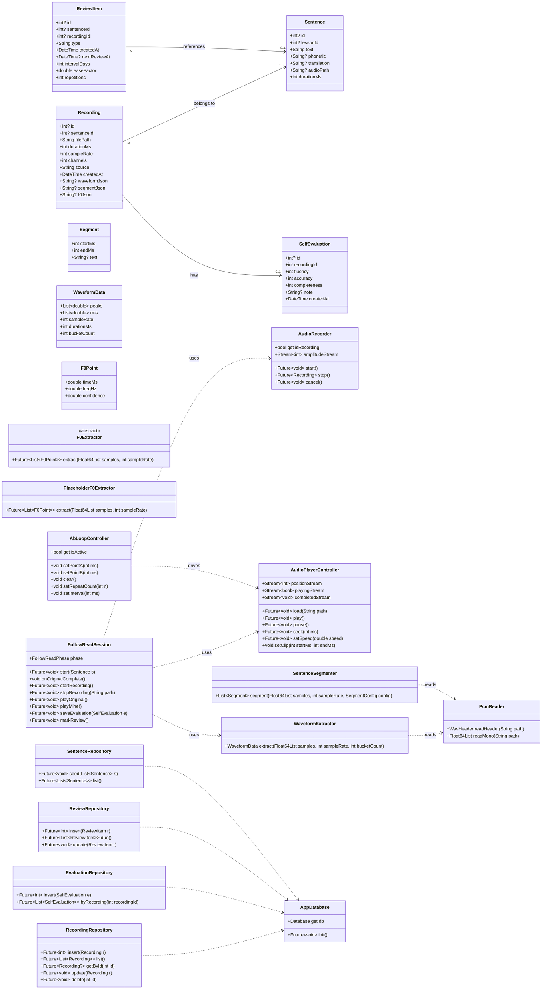
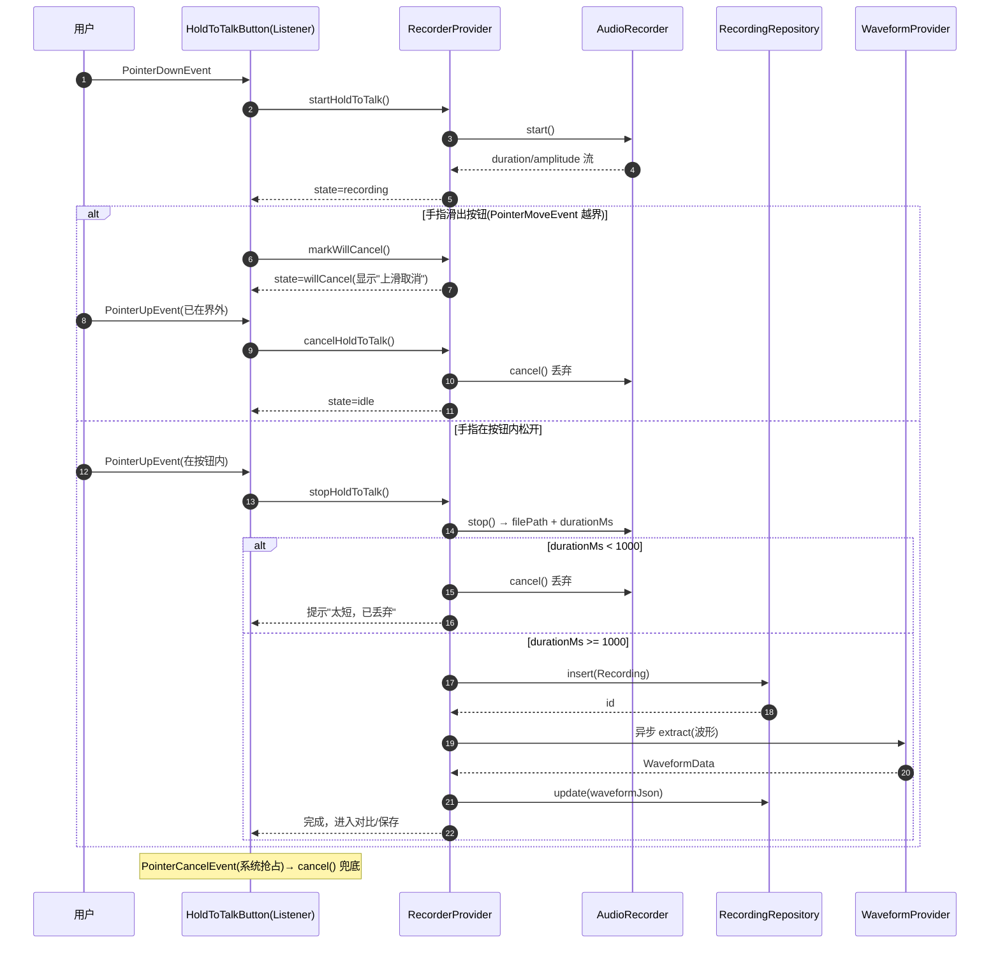
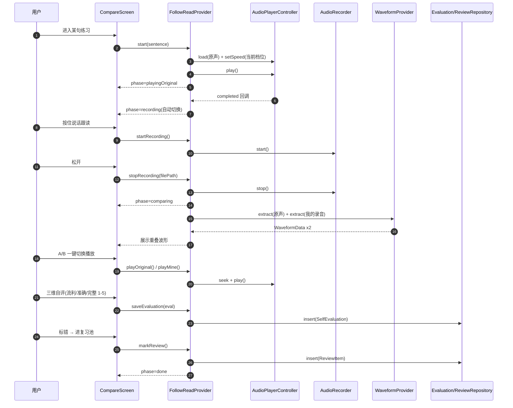
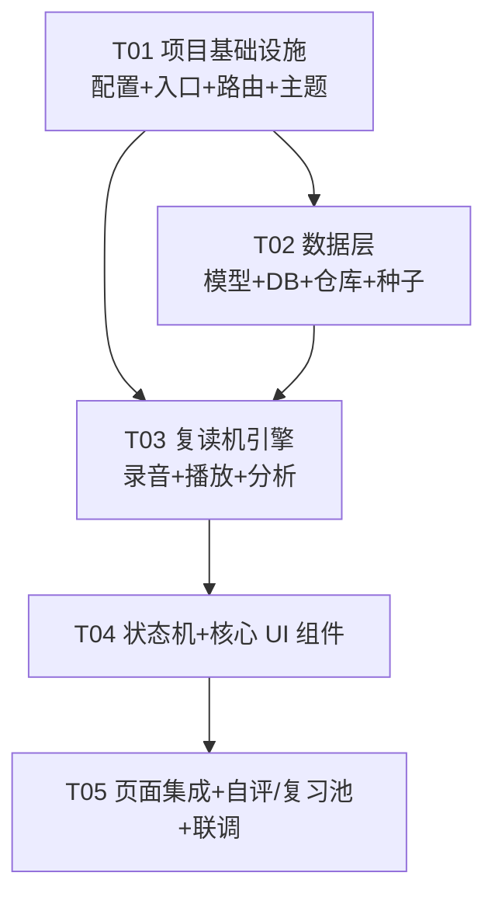

# 录音卡产品 · 软件层系统设计（M1 复读机引擎 Demo）

| 项目 | 内容 |
|------|------|
| 文档类型 | 系统设计 + 任务分解 |
| 里程碑 | M1 框架 + 复读机引擎 demo |
| 技术选型 | Flutter（Android 8.0+ 先行，iOS 后续） |
| 范围约束 | 纯本地、无账号、无后端、无 AI |
| 架构师 | Bob（软件架构师） |
| 编制日期 | 2026-09-15 |

> 本文档基于 SRS v1.3（`录音卡产品-软件层SRS-需求规格说明书.md`），聚焦 M1「复读机引擎 demo」的技术设计与任务分解。M1 只做本地闭环：**开口（录音）→ 回听 → 断句 → 变速/AB 复读 → 跟读对比 → 波形重叠 → 自评 → 复习池**。

---

# Part A：系统设计

## 1. 实现方案与框架选型

### 1.1 核心难点分析

| 难点 | 本质问题 | 关键约束 |
|------|----------|----------|
| 变速不变调 | 时间伸缩 + 音高保持（WSOLA/SOLA/相位声码器） | 0.5x–2.0x、音质不塌、实时性 |
| 按住说话 | 触摸事件与"按下即录/滑动取消/松开保存"状态机 | 误触、滑动取消、<1s 丢弃 |
| 波形可视化 | 百万级采样点 → 数百桶峰值，重绘性能 | 1 分钟音频波形 ≤1s 生成、滚动流畅 |
| 断句 | 静音检测切句 + 手动微调 | 阈值自适应、可调参 |
| AB 复读 | 区间循环 + 次数/间隔 | 精确到 ms、状态可控 |
| 跟读对比 | 原声→录音自动切换的会话状态机 | 播放完自动切录音、波形重叠 |
| F0 预留 | 基频数据模型 + 采集接口占位（M5 才实现算法） | 不实现、不阻塞 M1 |
| 本地存储 | 录音元数据/自评/复习池持久化 | 纯本地、可检索、可迁移 |

### 1.2 框架与依赖选型（含理由）

#### 1.2.1 变速不变调 —— 结论：`just_audio`（Android 原生 Sonic）+ FFmpeg `atempo` 离线兜底

| 方案 | 结论 | 取舍 |
|------|------|------|
| **just_audio** `setSpeed()` | ✅ **M1 主方案** | Android 底层走 **ExoPlayer `PlaybackParameters`**，默认使用 **Sonic** 音频处理器做时间伸缩，**天然不变调**，0.5x–2.0x 语音音质良好；API 成熟（`setSpeed`/`seek`/`setClip`/`positionStream`），无需自己写 FFI。 |
| **FFmpeg `atempo`** | ⚠️ 兜底/离线 | `atempo=0.5`~`2.0`（超范围用 `atempo=0.5,atempo=0.5` 链式），音高不变、音质稳定；但需 `ffmpeg_kit` 依赖体积大、离线预处理有延迟，**不做实时方案**。 |
| **SoundTouch（C++ FFI）** | ❌ 不选 | 质量好但需自建 Flutter FFI 桥接 + 各平台交叉编译，M1 集成成本高、维护重；Android 端 Sonic 已覆盖同等需求。 |
| **iOS 原生 AVAudioEngine timePitch** | 📌 M2+ 补丁 | `just_audio` 在 iOS 端基于 `AVPlayer.rate`，**会变调**（chipmunk 音）；SRS 明确 **Android 8.0+ 先行**，故 M1 不阻塞；iOS 上架前用 `AVAudioUnitTimePitch` 原生通道或 FFmpeg atempo 兜底。 |

> **最终结论**：M1 用 `just_audio.setSpeed(0.5–2.0)`，Android 不变调即满足 V-01。`AudioPlayerController` 内封装 `setSpeed` 并 `clamp(0.5, 2.0)`，速度档位 `0.5/0.75/1.0/1.25/1.5/1.75/2.0`。iOS 不变调作为已知后续项记录在「待明确事项」。

#### 1.2.2 录音 —— 结论：`record` 包 + **WAV PCM16 单声道 44.1kHz**

- `record` 是 Flutter 生态最成熟的录音库，支持 `AudioEncoder.wav`（PCM16）直出，**免解码即可读 PCM**（波形/F0 零成本），支持 `start/stop/cancel/dispose` 与 `onAmplitudeChanged`（预留耳返/电平条 C-07）。
- **录音格式统一 WAV PCM16 44.1kHz 单声道**：波形抽取与 M5 基频提取直接读样本，无 FFmpeg 解码依赖；1 分钟 ≈ 5.3MB，demo 阶段可接受，M2 再做 m4a 压缩。
- 需要 `permission_handler` 申请麦克风权限；Android `AndroidManifest.xml` 加 `RECORD_AUDIO`。

#### 1.2.3 按住说话触摸事件 —— 结论：`Listener`（原始指针事件）+ 显式状态机

- **不用 `GestureDetector.onLongPress*`**：长按有 ~500ms 判定延迟，不满足"**按下即录**"。
- **用 `Listener`** 监听 `PointerDownEvent/MoveEvent/UpEvent/CancelEvent`：
  - `onPointerDown` → 立即 `start()` 录音（按下即录）；
  - `onPointerMove` → 判断手指是否滑出按钮外接矩形（±阈值）→ 进入「上滑取消」态并给视觉反馈；
  - `onPointerUp` → 仍在按钮内 → 停止保存（`<1s` 丢弃）；已滑出 → `cancel()` 丢弃；
  - `onPointerCancel`（系统抢占）→ `cancel()`。
- 普通录音（非按住）用独立「点击切换」按钮（`GestureDetector.onTap`），与按住说话并存，两种交互都走同一个 `RecorderProvider`。

#### 1.2.4 波形绘制 —— 结论：PCM 分桶峰值压缩 + `CustomPainter`

- **数据侧**：`WaveformExtractor` 读 PCM16 → 按 `bucketCount`（默认 800–1600 桶）分桶，每桶取 **min/max 峰值**（画上下镜像波形）+ **RMS**（可选填充），归一化到 0–1，输出 `WaveformData`。大文件用 `compute()`（Isolate）离线抽取，避免 UI 卡顿。
- **渲染侧**：`CustomPainter` 画对称波形；两段波形用「原声为底（灰/蓝）、录音为顶（橙）半透明叠加」实现重叠对比；`RepaintBoundary` 隔离 + `shouldRepaint` 精确判定（仅在 `WaveformData` 或进度变化时重绘）。
- **缓存**：抽取结果序列化为 JSON 存进 `Recording.waveformJson`，二次打开秒开，满足"1 分钟音频 ≤1s 生成"。

#### 1.2.5 断句 —— 结论：能量阈值静音检测（Dart 纯算法），接口可替换

- `SentenceSegmenter`：分帧（20ms）算 RMS 能量 → 低于 `silenceDb`（默认 -40dBFS）判静音 → 连续静音 > `minSilenceMs`（默认 300ms）作为切点 → 句段时长 > `minSegmentMs`（默认 500ms）保留。
- 输出 `List<Segment>{startMs,endMs,text?}`，参数 `SegmentConfig` 可调；手动微调由 `SegmentList` 组件拖拽边界实现。
- 接口抽象 `Segmenter`，M4 可无缝换成 ASR 语义断句。

#### 1.2.6 F0 基频预留 —— 结论：数据模型 + 抽象接口占位，不实现算法

- 模型：`F0Point{timeMs, freqHz, confidence}`；`Recording.f0Json` 字段预留（M1 恒为 `null`）。
- 接口：`abstract class F0Extractor { Future<List<F0Point>> extract(Float64List samples, int sampleRate); }`，M1 提供 `PlaceholderF0Extractor`（返回空表 / 抛 `NotImplementedError`），**不实现 YIN/自相关算法**。
- M5 接入时只需实现 `F0Extractor` 并注入，UI 的「语调曲线叠加」组件复用波形绘制通道，模型无需改动。

#### 1.2.7 本地存储 —— 结论：`sqflite`（SQLite）+ 文件系统分离

| 方案 | 结论 | 理由 |
|------|------|------|
| **sqflite** | ✅ 主方案 | 录音↔句子↔自评↔复习池是**关系型**结构（外键、排序、按条件检索），SQL 最自然；成熟稳定、Android/iOS 兼容好。 |
| Isar | ❌ | 快，但需 codegen、二进制文件锁、跨平台细节坑多，M1 关系查询场景发挥不出优势。 |
| Hive | ❌ | 无 schema 的 KV，做"按课程/时间筛选、复习池调度排序"很别扭。 |

- **存储分工**：音频文件存应用文档目录（`path_provider`），数据库只存元数据 + 文件相对路径 + 波形/断句 JSON。
- 提供 4 个 Repository（Recording/Sentence/Evaluation/Review）隔离 SQL，方便 M2 平滑替换为后端。

#### 1.2.8 状态管理 —— 结论：`flutter_riverpod`（非 codegen，轻量）

| 方案 | 结论 | 理由 |
|------|------|------|
| **Riverpod** | ✅ | 无 `BuildContext` 依赖、可独立测试；`NotifierProvider` 极适合表达"引擎级状态"（播放器/录音机/跟读会话）；比 Provider 少坑，比 Bloc 轻（Bloc 事件驱动更适合大团队长期演进，M1 demo 偏重）。 |
| Provider | ❌ | 有 context 依赖与多 Provider 嵌套坑。 |
| Bloc | ⚠️ 备选 | 规范但样板代码多，demo 阶段收益低。 |

#### 1.2.9 路由 —— 结论：`go_router`

- M1 只有 5 个页面，但 M2 有"点句直达练习、复习池、录音详情"等深链需求，`go_router` 是当前 Flutter 标准方案，路由表集中、可扩展，成本低。

#### 1.2.10 Flutter / Dart 版本

- **Flutter ≥ 3.24 stable，Dart ≥ 3.5**；依赖版本以 `pub.dev` 最新稳定版为准。

---

## 2. 文件列表（完整工程结构树）

```
recording-card-app/
├── pubspec.yaml
├── analysis_options.yaml
├── android/                          # 原生（Android 8.0+，加 RECORD_AUDIO 权限）
├── ios/                              # 原生（预留，加 NSMicrophoneUsageDescription）
├── assets/
│   └── sample/                       # 内置示例原声（demo 数据）
│       └── sample_sentence.wav
├── docs/
│   ├── system_design.md
│   ├── class-diagram.mermaid
│   └── sequence-diagram.mermaid
└── lib/
    ├── main.dart                     # 入口：ProviderScope + App
    ├── app.dart                      # MaterialApp.router + 主题
    ├── core/
    │   ├── constants/
    │   │   ├── app_constants.dart    # 应用级常量
    │   │   └── audio_constants.dart  # 采样率/声道/语速档位/断句默认参数
    │   ├── theme/
    │   │   └── app_theme.dart        # 主题/配色
    │   ├── utils/
    │   │   ├── logger.dart           # 轻量日志
    │   │   └── time_formatter.dart   # ms↔mm:ss
    │   └── error/
    │       └── app_exception.dart    # 统一异常类型
    ├── models/
    │   ├── sentence.dart             # Sentence
    │   ├── recording.dart            # Recording（含 f0Json 预留）
    │   ├── self_evaluation.dart      # SelfEvaluation
    │   ├── review_item.dart          # ReviewItem
    │   ├── segment.dart              # Segment
    │   ├── waveform_data.dart        # WaveformData
    │   └── f0_point.dart             # F0Point
    ├── data/
    │   ├── database/
    │   │   ├── app_database.dart     # 建库/建表/版本迁移
    │   │   └── db_helper.dart        # 连接单例 + 通用查询
    │   ├── repositories/
    │   │   ├── sentence_repository.dart
    │   │   ├── recording_repository.dart
    │   │   ├── evaluation_repository.dart
    │   │   └── review_repository.dart
    │   └── seed/
    │       └── sample_seed.dart      # 内置示例句子/原声
    ├── engine/
    │   ├── audio/
    │   │   ├── audio_recorder.dart           # record 封装
    │   │   ├── audio_player_controller.dart  # just_audio 封装
    │   │   └── pcm_reader.dart               # WAV PCM16 解析
    │   ├── analysis/
    │   │   ├── waveform_extractor.dart
    │   │   ├── sentence_segmenter.dart
    │   │   └── f0_extractor.dart             # 抽象 + PlaceholderF0Extractor
    │   ├── ab_loop/
    │   │   └── ab_loop_controller.dart
    │   └── follow_read/
    │       └── follow_read_session.dart      # 跟读对比状态机
    ├── state/
    │   ├── providers.dart            # 依赖注入聚合（db/repos 的 Provider）
    │   ├── player_provider.dart
    │   ├── recorder_provider.dart
    │   ├── segment_provider.dart
    │   ├── waveform_provider.dart
    │   ├── follow_read_provider.dart
    │   ├── evaluation_provider.dart
    │   └── review_provider.dart
    └── ui/
        ├── routing/
        │   └── app_router.dart
        ├── screens/
        │   ├── home_screen.dart             # 首页：示例句子入口
        │   ├── practice_screen.dart         # 复读机主页（录音/播放/断句/AB/变速）
        │   ├── compare_screen.dart          # 跟读对比 + 波形重叠
        │   ├── recording_list_screen.dart   # 录音列表
        │   └── review_pool_screen.dart      # 复习池
        └── widgets/
            ├── hold_to_talk_button.dart     # 按住说话（Listener）
            ├── record_toggle_button.dart    # 普通录音（tap 切换）
            ├── waveform_view.dart           # 单波形 CustomPainter
            ├── waveform_comparison_view.dart# 原声/录音重叠对比
            ├── playback_controls.dart       # 播放/暂停/进度/seek
            ├── speed_selector.dart          # 语速档位
            ├── ab_loop_bar.dart             # A/B 点设置条
            ├── segment_list.dart            # 断句列表 + 手动微调
            └── self_evaluation_sheet.dart   # 三维自评弹层
```

---

## 3. 数据结构和接口（类图）



---

## 4. 程序调用流程（时序图）

### 4.1 按住说话录音（含滑动取消 / <1s 丢弃）



### 4.2 跟读对比（原声→录音→波形重叠→自评→复习池）



---

## 5. 待明确事项（Anything UNCLEAR）

### 软件侧需拍板
1. **iOS 不变调**：M1 Android 先行，`just_audio` 在 iOS 会变调；是否接受"iOS 上架前再补 AVAudioEngine timePitch"？（当前假设：接受，记录为 M2 技术债）
2. **录音格式**：M1 用 WAV PCM16 44.1kHz（便于波形/F0），1 分钟 ≈5.3MB 是否可接受？若需省存储可降为 16kHz 单声道（≈1.9MB/min，语音足够）。
3. **示例原声来源**：demo 内置 1–3 句示例原声（需真人录制或临时 TTS），内容/音频由谁提供？M1 假设用 1 条本地 `sample_sentence.wav` 占位。

### 需硬件（郭准）确认（M3 前，不影响 M1）
4. 录音卡录音文件格式/采样率（App 侧需统一到 PCM16 做波形/F0 解码适配）。
5. 卡↔手机传输协议（BLE 控制 + 文件通道假设）。

### 需 AI（焦子冲）确认（M4/M5 前，不影响 M1）
6. F0 基频算法的目标精度与帧率（M1 仅预留 `F0Point{timeMs,freqHz,confidence}` 结构，具体字段 M5 前对齐）。
7. 过程数据埋点字段（K-01）与 `Recording.f0Json` 的最终 schema 是否一致。
8. 纠音 API 选型与接口字段（M4 对接）。

---

# Part B：任务分解

## 6. 依赖包列表（pubspec.yaml）

```yaml
name: recording_card_app
description: 录音卡 - 英语口语练习 App（M1 复读机引擎 demo）
publish_to: 'none'
version: 0.1.0

environment:
  sdk: '>=3.5.0 <4.0.0'

dependencies:
  flutter:
    sdk: flutter
  # 状态管理
  flutter_riverpod: ^2.5.1
  # 路由
  go_router: ^14.2.0
  # 播放 + 变速不变调（Android=ExoPlayer/Sonic）
  just_audio: ^0.9.39
  # 录音（WAV PCM16）
  record: ^5.1.2
  # 本地数据库
  sqflite: ^2.3.3
  path: ^1.9.0
  # 文件目录
  path_provider: ^2.1.4
  # 麦克风权限
  permission_handler: ^11.3.1
  # 时间格式化
  intl: ^0.19.0

dev_dependencies:
  flutter_test:
    sdk: flutter
  flutter_lints: ^4.0.0

flutter:
  uses-material-design: true
  assets:
    - assets/sample/
```

> 版本号以 `pub.dev` 当日最新稳定版为准。M1 **严禁**引入 `firebase_*`/`http` 后端调用/云存储/AI SDK。iOS 不变调兜底（`ffmpeg_kit_flutter` 或原生 AVAudioEngine）暂不引入，留待 M2。

---

## 7. 任务列表（按实现顺序，含依赖与验收标准）

> 粒度说明：任务按"层"划分（基础设施 → 数据层 → 引擎层 → UI 组件 → 页面集成），**每任务内列明到「文件/类」级别**，可直接敲代码。依赖为单向链，`T01` 为唯一硬前提。

### T01 项目基础设施（P0）
- **Source Files**：
  - `pubspec.yaml`、`analysis_options.yaml`
  - `lib/main.dart`、`lib/app.dart`
  - `lib/ui/routing/app_router.dart`
  - `lib/core/theme/app_theme.dart`
  - `lib/core/constants/app_constants.dart`、`lib/core/constants/audio_constants.dart`
  - `lib/core/utils/logger.dart`、`lib/core/utils/time_formatter.dart`
  - `lib/core/error/app_exception.dart`
  - `android/app/src/main/AndroidManifest.xml`（加 `RECORD_AUDIO`）
- **Dependencies**：无
- **验收标准**：
  1. `flutter run` 可在 Android 8.0+ 真机/模拟器启动，显示空壳首页。
  2. 路由表含 `/home`、`/practice`、`/compare`、`/recordings`、`/review` 5 条，均可导航（先挂占位页面）。
  3. `audio_constants.dart` 定义：`sampleRate=44100`、`channels=1`、语速档位列表、断句默认参数、`minValidDurationMs=1000`。
  4. 麦克风权限申请链路可用（点击触发弹窗，拒绝/允许两种回调正常）。

### T02 数据层：模型 + 本地库 + 仓库 + 种子（P0）
- **Source Files**：
  - `lib/models/sentence.dart`、`recording.dart`、`self_evaluation.dart`、`review_item.dart`、`segment.dart`、`waveform_data.dart`、`f0_point.dart`
  - `lib/data/database/db_helper.dart`、`lib/data/database/app_database.dart`
  - `lib/data/repositories/sentence_repository.dart`、`recording_repository.dart`、`evaluation_repository.dart`、`review_repository.dart`
  - `lib/data/seed/sample_seed.dart`
  - `lib/state/providers.dart`（聚合 db/repo 的 Provider）
- **Dependencies**：T01
- **验收标准**：
  1. `AppDatabase.init()` 建 4 张表（sentence/recording/self_evaluation/review_item），含外键与索引，可重复打开不报错。
  2. `Recording.f0Json`、`waveformJson`、`segmentJson` 字段存在（可空，默认 null）。
  3. 4 个 Repository 的 insert/list/getById/update/delete 单测或手动验证通过。
  4. `sample_seed.dart` 首次启动插入 ≥1 条示例 Sentence 并复制 `sample_sentence.wav` 到文档目录。

### T03 复读机引擎：录音 + 播放 + 分析（P0）
- **Source Files**：
  - `lib/engine/audio/pcm_reader.dart`
  - `lib/engine/audio/audio_recorder.dart`
  - `lib/engine/audio/audio_player_controller.dart`
  - `lib/engine/analysis/waveform_extractor.dart`
  - `lib/engine/analysis/sentence_segmenter.dart`
  - `lib/engine/analysis/f0_extractor.dart`（抽象 + Placeholder）
  - `lib/engine/ab_loop/ab_loop_controller.dart`
  - `lib/state/recorder_provider.dart`、`player_provider.dart`、`segment_provider.dart`、`waveform_provider.dart`
- **Dependencies**：T02（依赖模型）
- **验收标准**：
  1. `AudioRecorder.start/stop/cancel` 可录制 WAV PCM16 44.1kHz 单声道，`<1s` 丢弃逻辑在 Provider 层生效（V-02）。
  2. `AudioPlayerController.setSpeed(0.5–2.0)` Android 端不变调、0.5x/2x 音质可用（V-01）。
  3. `AbLoopController` 设 A/B 后可区间循环，重复次数与间隔可配（V-01）。
  4. `WaveformExtractor` 对 1 分钟音频抽取波形耗时 ≤1s（V-01）。
  5. `SentenceSegmenter` 对示例原声能切出 ≥2 个句段，参数可调（V-01）。
  6. `PlaceholderF0Extractor` 存在且调用不崩溃（M1 不实现算法）。

### T04 跟读对比状态机 + 核心 UI 组件（P0）
- **Source Files**：
  - `lib/engine/follow_read/follow_read_session.dart`
  - `lib/state/follow_read_provider.dart`
  - `lib/ui/widgets/hold_to_talk_button.dart`
  - `lib/ui/widgets/record_toggle_button.dart`
  - `lib/ui/widgets/waveform_view.dart`
  - `lib/ui/widgets/waveform_comparison_view.dart`
  - `lib/ui/widgets/playback_controls.dart`
  - `lib/ui/widgets/speed_selector.dart`
  - `lib/ui/widgets/ab_loop_bar.dart`
  - `lib/ui/widgets/segment_list.dart`
- **Dependencies**：T03
- **验收标准**：
  1. `FollowReadSession` 状态机：Idle→PlayingOriginal→Recording→Comparing→Done，原声播完自动切录音态（V-03）。
  2. `HoldToTalkButton`：按下即录、滑出取消、松开保存、`<1s` 丢弃 + toast 提示（V-02）。
  3. `RecordToggleButton`：tap 开始/tap 停止的普通录音。
  4. `WaveformComparisonView`：原声（底）+ 录音（顶半透明）重叠渲染，滚动/进度高亮流畅（V-01）。
  5. `SpeedSelector`/`AbLoopBar`/`SegmentList` 与引擎 Provider 联动，实时生效。

### T05 页面集成 + 自评/复习池 + 联调（P0）
- **Source Files**：
  - `lib/ui/screens/home_screen.dart`
  - `lib/ui/screens/practice_screen.dart`
  - `lib/ui/screens/compare_screen.dart`
  - `lib/ui/screens/recording_list_screen.dart`
  - `lib/ui/screens/review_pool_screen.dart`
  - `lib/ui/widgets/self_evaluation_sheet.dart`
  - `lib/state/evaluation_provider.dart`、`review_provider.dart`
- **Dependencies**：T04
- **验收标准**：
  1. 首页进入示例句 → 练习页完成"录音→断句→变速→AB 复读→跟读对比→波形重叠"完整闭环（V-01/V-02/V-03）。
  2. 三维自评（流利/准确/完整 1–5）落库并可在录音详情检索回显（V-04）。
  3. 标错/收藏可写入复习池，复习池列表按 `nextReviewAt` 排序展示（V-04 扩展）。
  4. 全流程 Android 真机无崩溃、无权限异常、离线可用（关闭网络不影响功能）。
  5. `flutter analyze` 无 error，关键路径手工测试通过。

---

## 8. 共享知识（跨文件约定）

### 命名与目录约定
- 文件/类名：模型用单数名词（`Recording`、`Sentence`）；Repository 用 `XxxRepository`；Provider 用 `xxxProvider` / `XxxNotifier`；Widget 用 `XxxView/Button/Bar/Screen`。
- 目录分层：`core`（横切）/ `models`（纯数据）/ `data`（持久化）/ `engine`（领域逻辑）/ `state`（Riverpod 胶水）/ `ui`（视图）。**依赖方向单向**：`ui → state → engine/data → models → core`，禁止反向引用。

### 数据流向约定
- **音频文件**存应用文档目录 `documents/recordings/`，DB 只存**相对路径**（`recordings/xxx.wav`），跨设备迁移只需搬目录 + DB。
- 时间戳一律存 **epoch milliseconds（int）**；时长/位置统一用 **int 毫秒**；显示层用 `TimeFormatter` 转 `mm:ss`。
- 自评分数 `int 1–5`；ReviewItem.type 枚举 `favorite | error | word`。
- 波形/断句/基频均序列化为 **JSON 字符串**存入对应 `*Json` 字段，反序列化时做容错（解析失败返回空对象，不崩溃）。

### 引擎与状态约定
- 所有"引擎控制器"（Player/Recorder/Session/AbLoop）为**无 UI 依赖的纯 Dart 类**，可脱离 Widget 单测；Riverpod Provider 只负责"创建/装配/暴露状态流"。
- 变速调用只经 `AudioPlayerController.setSpeed`，内部统一 `clamp(0.5, 2.0)`，档位在 `audio_constants.dart` 唯一维护。
- 录音的"最短 1s 校验"**只在 RecorderProvider 层**做一次，UI 层不再重复判断。

### 平台约定
- M1 以 Android 为准；iOS 仅保证可编译，不变调问题记入 M2 技术债。
- 麦克风权限：进入练习页前必须确保已授权，未授权时弹引导，不可直接 `start()`。

---

## 9. 任务依赖图



- 关键路径：`T01 → T02 → T03 → T04 → T05`。
- `T01` 是唯一硬前提；`T02`（模型）与 `T03` 中纯分析类（波形/断句/F0）可部分并行，但 `T03` 的录音/播放封装需 `T02` 的 `Recording` 模型，故按线性推进最稳妥。
- 每个任务完成后即可 `flutter run` 自测，不要求一次到位全部页面。
