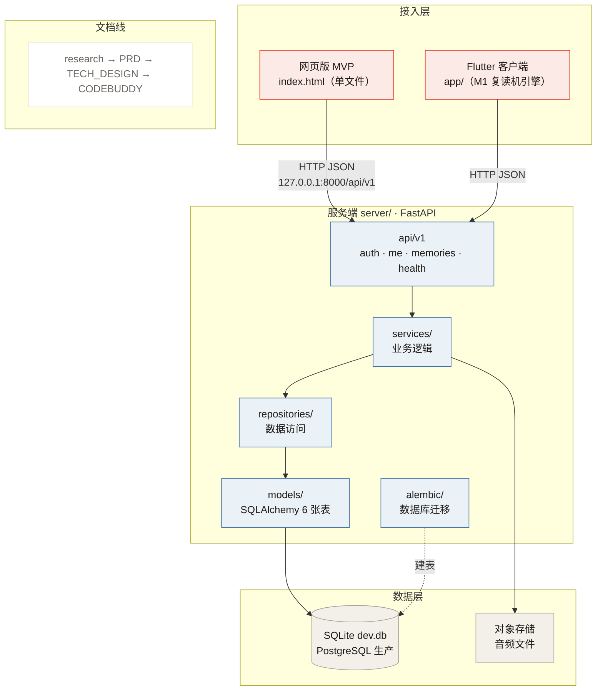

# AI 记忆卡 · 项目结构图

> 最后更新：2026-09-23（Day 7）
> 用途：一眼看懂「这个仓库里有什么、怎么分层、数据怎么流」。

## 一、一句话结构

一个仓库，三层加一条文档线：

```
接入层（网页 / 手机）  →  服务端（FastAPI）  →  数据层（SQLite / PostgreSQL）
```

外加一整套「研究 → PRD → 技术设计 → 规则」的文档。

---

## 二、目录树（真实结构）

```text
AI-sound-card/
├── index.html                  # 网页版 MVP（单文件，零依赖）★Day 7
├── app/                        # Flutter 客户端（M1 复读机引擎）
│   ├── lib/
│   │   ├── engine/             # 音频引擎：录音 / 播放 / 波形 / F0 / 断句 / AB 循环 / 跟读
│   │   ├── ui/                 # 界面：screens（页面）+ widgets（组件）
│   │   ├── state/              # 状态管理（Provider）
│   │   ├── data/               # 本地数据库 + 仓储 + 种子数据
│   │   ├── models/             # 数据模型
│   │   └── core/               # 主题 / 常量 / 异常 / 工具
│   └── android/ ios/           # 平台目录（仅这两个，无 web target）
├── server/                     # FastAPI 服务端
│   ├── app/
│   │   ├── api/v1/             # 路由：auth / me / memories / health
│   │   ├── services/           # 业务逻辑（含幂等 upsert、修订号判定）
│   │   ├── repositories/       # 数据访问
│   │   ├── models/             # SQLAlchemy 6 张表
│   │   ├── schemas/            # 请求 / 响应模型
│   │   ├── core/               # 配置 / 安全 / 错误处理
│   │   └── db/                 # 数据库会话
│   ├── alembic/                # 数据库迁移
│   ├── scripts/                # e2e 测试脚本
│   ├── dev.db                  # 开发期 SQLite 数据库
│   └── .venv/                  # 虚拟环境（不入库）
├── docs/                       # 设计文档 + 运行说明 + 时序图/类图 + 演示材料
│   ├── system_design.md        # M1 口语线子设计（类图 + 时序图）
│   ├── 环境搭建说明.md          # Flutter 真机环境
│   ├── 运行说明.md              # ★Day 7：怎么把 MVP 跑起来
│   └── demo/                   # 录屏脚本 + Swagger 测试清单 + 证据
├── research.md                 # 竞品研究（Day 3）
├── PRD.md                      # 产品需求文档（Day 4，v0.5）
├── TECH_DESIGN.md              # 技术设计（Day 5，v0.5）
├── CODEBUDDY.md                # 项目规则（十章）
├── 录音卡产品-软件层SRS-需求规格说明书.md   # 口语线详规
└── README.md                   # 项目门面
```

---

## 三、架构分层图



---

## 四、数据怎么流（以网页版为例）

1. 浏览器打开 `http://localhost:5500/`（网页由 `python -m http.server` 发出）
2. 页面静默登录 → `POST /api/v1/auth/login`（401 则 `register`）→ 拿到 token
3. 列表为空 → `PUT /api/v1/memories/{id}` 种 3 条演示记忆（幂等写入）
4. `GET /api/v1/memories?limit=50` 拉列表 → 渲染成卡片
5. 服务端把数据落到 SQLite（`server/dev.db`）

> 后端连不上时，页面回退到内置示例数据，不白屏。

---

## 五、两条产品线

| 产品线 | 状态 | 落点 |
|---|---|---|
| ① 口语练习（M1 复读机引擎） | 可运行（`app/`） | Flutter 真机 |
| ② 日常记录 → 整理入库 | MVP 第一版（`index.html` + `server/`） | 网页 + 服务端 |
